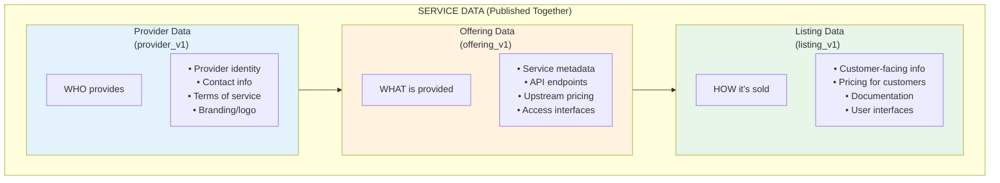

# UnitySVC Services SDK


[](https://unitysvc-services.readthedocs.io/en/latest/?version=latest)

Client library and CLI tools for sellers and providers of digital services to interact with the UnitySVC platform.

**[Full Documentation](https://unitysvc-services.readthedocs.io)** | **[Getting Started](https://unitysvc-services.readthedocs.io/en/latest/getting-started/)** | **[CLI Reference](https://unitysvc-services.readthedocs.io/en/latest/cli-reference/)**

## Two Ways to Manage Service Data

UnitySVC provides two complementary approaches for managing your seller service data:

### 1. Web Interface (unitysvc.com)

The [UnitySVC web platform](https://unitysvc.com) provides a user-friendly interface to:
- Create, edit, and manage providers, offerings, and listings
- Validate data with instant feedback
- Preview how services appear to customers
- Export data for use with the SDK

**Best for**: Initial setup, visual editing, and teams preferring a graphical interface.

### 2. SDK (this package)

The SDK enables a **local-first, version-controlled workflow** with key advantages:

- **Version Control** - Track all changes in git, review diffs, roll back mistakes
- **Script-Based Generation** - Programmatically generate services from provider APIs
- **CI/CD Automation** - Automatically check service status and publish updates via GitHub Actions
- **Offline Work** - Edit locally, validate without network, publish when ready
- **Code Review** - Use pull requests to review service changes before publishing

**Best for**: Large catalogs, dynamic services, automation, and teams with developer workflows.

### Recommended Workflow

1. **Start with the web interface** at [unitysvc.com](https://unitysvc.com) to create your initial service data
2. **Export your data** to local files for version control
3. **Use the SDK** for ongoing management, automation, and CI/CD integration

## Installation

```bash
pip install unitysvc-services
```

Requires Python 3.11+

**CLI Alias:** The command `unitysvc_services` can also be invoked using the shorter alias `usvc`.

## Service Data Model

A **Service** in UnitySVC consists of three complementary data components that are organized separately for reuse but **published together** as a single unit:



### Why Three Parts?

1. **Provider Data** - Defined once per provider, reused across all their offerings
2. **Offering Data** - Defined once per service, can have multiple listings
3. **Listing Data** - Defines how each service variant is presented to customers

This separation enables:
- **Reusability**: One provider can have many offerings; one offering can have multiple listings
- **Maintainability**: Update provider info once, affects all services
- **Flexibility**: Different pricing tiers, marketplaces, or customer segments per listing

## Quick Example

```bash
# 1. Export data from unitysvc.com or create files manually
#    Place files in: data/{provider}/services/{service}/

# 2. Validate and format your local data
usvc validate
usvc format

# 3. Test code examples with upstream credentials
usvc test list --provider my-provider
usvc test run --provider my-provider --services "my-*"

# 4. For dynamic catalogs, use populate scripts
usvc populate

# 5. Publish to platform (publishes provider + offering + listing together)
export UNITYSVC_BASE_URL="https://api.unitysvc.com/api/v1"
export UNITYSVC_API_KEY="your-seller-api-key"
usvc publish

# 6. Query backend to verify published data
usvc query providers --fields id,name,contact_email
```

## Data Structure

```
data/
├── ${provider_name}/
│   ├── provider.json              # Provider Data (provider_v1)
│   ├── docs/                      # Shared documentation
│   └── services/
│       └── ${service_name}/
│           ├── service.json       # Offering Data (offering_v1)
│           └── listing-*.json     # Listing Data (listing_v1) ← publish entry point
```

**Publishing is listing-centric**: When you run `usvc publish`, the SDK:
1. Finds all listing files (`listing_v1` schema)
2. For each listing, locates the **single** offering file in the same directory
3. Locates the provider file in the parent directory
4. Publishes all three together as a unified service

**Key constraint**: Each service directory must have exactly **one** offering file. Listings automatically belong to this offering based on their file location—no explicit linking required.

See [Data Structure Documentation](https://unitysvc-services.readthedocs.io/en/latest/data-structure/) for complete details.

## Key Features

-   **Unified Publishing** - Provider, offering, and listing published together atomically
-   **Pydantic Models** - Type-safe data models for all entities
-   **Data Validation** - Comprehensive schema validation
-   **Local-First** - Work offline, commit to git, publish when ready
-   **CLI Tools** - Complete command-line interface
-   **Automation** - Script-based service generation
-   **Multiple Formats** - Support for JSON and TOML
-   **Smart Routing** - Request routing based on routing keys (e.g., model-specific endpoints)

## Workflows

### Getting Started

```bash
web interface (create data) → export → validate → publish
```

### Ongoing Management

```bash
edit files → validate → format → test → commit → publish
```

### Automated Workflow (large/dynamic catalogs)

```bash
configure populate script → populate → validate → publish (via CI/CD)
```

See [Workflows Documentation](https://unitysvc-services.readthedocs.io/en/latest/workflows/) for details.

## CLI Commands

| Command     | Description                                      |
| ----------- | ------------------------------------------------ |
| `list`      | List local data files                            |
| `query`     | Query backend API for published data             |
| `publish`   | Publish services to backend                      |
| `unpublish` | Unpublish (delete) data from backend             |
| `update`    | Update local file fields                         |
| `validate`  | Validate data consistency                        |
| `format`    | Format data files                                |
| `populate`  | Execute provider populate scripts                |
| `test`      | Test code examples with upstream API credentials |

Run `usvc --help` or see [CLI Reference](https://unitysvc-services.readthedocs.io/en/latest/cli-reference/) for complete documentation.

## Documentation

-   **[Getting Started](https://unitysvc-services.readthedocs.io/en/latest/getting-started/)** - Installation and first steps
-   **[Data Structure](https://unitysvc-services.readthedocs.io/en/latest/data-structure/)** - File organization and Service Data model
-   **[Workflows](https://unitysvc-services.readthedocs.io/en/latest/workflows/)** - Manual and automated patterns
-   **[Documenting Service Listings](https://unitysvc-services.readthedocs.io/en/latest/documenting-services/)** - Add documentation to services
-   **[Creating Code Examples](https://unitysvc-services.readthedocs.io/en/latest/code-examples/)** - Develop and test code examples
-   **[CLI Reference](https://unitysvc-services.readthedocs.io/en/latest/cli-reference/)** - All commands and options
-   **[File Schemas](https://unitysvc-services.readthedocs.io/en/latest/file-schemas/)** - Schema specifications
-   **[Python API](https://unitysvc-services.readthedocs.io/en/latest/api-reference/)** - Programmatic usage

## Links

-   **PyPI**: https://pypi.org/project/unitysvc-services/
-   **Documentation**: https://unitysvc-services.readthedocs.io
-   **Source Code**: https://github.com/unitysvc/unitysvc-services
-   **Issue Tracker**: https://github.com/unitysvc/unitysvc-services/issues

## License

MIT License - see [LICENSE](LICENSE) file for details.

## Contributing

Contributions welcome! See [Contributing Guide](https://unitysvc-services.readthedocs.io/en/latest/contributing/) for details.
