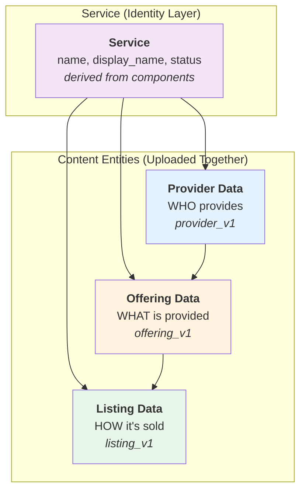

# UnitySVC Services SDK


[](https://unitysvc-services.readthedocs.io/en/latest/?version=latest)

Client library and CLI tools for sellers and providers of digital services to interact with the UnitySVC platform.

**[Full Documentation](https://unitysvc-services.readthedocs.io)** | **[Getting Started](https://unitysvc-services.readthedocs.io/en/latest/getting-started/)** | **[CLI Reference](https://unitysvc-services.readthedocs.io/en/latest/cli-reference/)**

## Two Ways to Manage Service Data

UnitySVC provides two complementary approaches for managing your seller service data:

### 1. Web Interface (unitysvc.com)

The [UnitySVC web platform](https://unitysvc.com) provides a user-friendly interface to:

-   Create, edit, and manage providers, offerings, and listings
-   Validate data with instant feedback
-   Preview how services appear to customers
-   Export data for use with the SDK

**Best for**: Initial setup, visual editing, and teams preferring a graphical interface.

### 2. SDK (this package)

The SDK enables a **local-first, version-controlled workflow** with key advantages:

-   **Version Control** - Track all changes in git, review diffs, roll back mistakes
-   **Script-Based Generation** - Programmatically generate services from provider APIs
-   **CI/CD Automation** - Automatically upload updates and manage service lifecycle via GitHub Actions
-   **Offline Work** - Edit locally, validate without network, upload when ready
-   **Code Review** - Use pull requests to review service changes before uploading
-   **Service Lifecycle** - Submit services for review, deprecate outdated services, withdraw services from marketplace

**Best for**: Large catalogs, dynamic services, automation, and teams with developer workflows.

### Recommended Workflow

1. **Start with the web interface** at [unitysvc.com](https://unitysvc.com) to create your initial service data
2. **Export your data** to local files for version control
3. **Use the SDK** for ongoing management, automation, and CI/CD integration

## Installation

```bash
pip install unitysvc-services
```

Requires Python 3.11+

**CLI Alias:** The command `unitysvc_services` can also be invoked using the shorter alias `usvc`.

## Service Data Model

A **Service** in UnitySVC is an identity layer that connects a seller to three complementary data components. These components are organized separately for reuse but **uploaded together** as a single unit:



### Service Identity

When you upload provider, offering, and listing data together, the platform creates a **Service** record that:

-   **Links** the seller to the content (provider, offering, listing)
-   **Derives its name** from `listing.name`, or `offering.name` if listing name is unspecified
-   **Derives its display_name** from `listing.display_name`, `offering.display_name`, `listing.name`, or `offering.name` (first non-empty value)
-   **Derives its status** from the component statuses - a service is considered `draft` if any component is draft

The Service provides a stable identity that subscriptions reference, while the content entities (Provider, Offering, Listing) are immutable and content-addressed.

### Why Three Parts?

1. **Provider Data** - Defined once per provider, reused across all their offerings
2. **Offering Data** - Defined once per service, can have multiple listings
3. **Listing Data** - Defines how each service variant is presented to customers

This separation enables:

-   **Reusability**: One provider can have many offerings; one offering can have multiple listings
-   **Maintainability**: Update provider info once, affects all services
-   **Flexibility**: Different pricing tiers, marketplaces, or customer segments per listing
-   **Immutability**: Content entities are content-addressed; same content = same ID

## Quick Example

```bash
# 1. Export data from unitysvc.com or create files manually
#    Place files in: data/{provider}/services/{service}/

# 2. Validate and format your local data
usvc data validate
usvc data format

# 3. Run code examples locally with upstream credentials
usvc data list-tests
usvc data run-tests --provider my-provider

# 4. For dynamic catalogs, use populate scripts
usvc data populate

# 5. Upload to platform (uploads provider + offering + listing together)
export UNITYSVC_BASE_URL="https://api.unitysvc.com/v1"
export UNITYSVC_API_KEY="your-seller-api-key"
usvc services upload

# 6. Test via gateway and submit for review
usvc services list-tests
usvc services run-tests
usvc services submit <service-id>

# 7. Query backend to verify uploaded data
usvc services list
```

## Data Structure

```
data/
├── ${provider_name}/
│   ├── provider.json              # Provider Data (provider_v1)
│   ├── docs/                      # Shared documentation
│   └── services/
│       └── ${service_name}/
│           ├── offering.json      # Offering Data (offering_v1)
│           └── listing-*.json     # Listing Data (listing_v1) ← upload entry point
```

**Uploading is listing-centric**: When you run `usvc services upload`, the SDK:

1. Finds all listing files (`listing_v1` schema)
2. For each listing, locates the **single** offering file in the same directory
3. Locates the provider file in the parent directory
4. Uploads all three together as a unified service in `draft` status

**Key constraint**: Each service directory must have exactly **one** offering file. Listings automatically belong to this offering based on their file location—no explicit linking required.

See [Data Structure Documentation](https://unitysvc-services.readthedocs.io/en/latest/data-structure/) for complete details.

## Key Features

-   **Unified Upload** - Provider, offering, and listing uploaded together atomically
-   **Pydantic Models** - Type-safe data models for all entities
-   **Data Validation** - Comprehensive schema validation
-   **Local-First** - Work offline, commit to git, upload when ready
-   **CLI Tools** - Complete command-line interface
-   **Automation** - Script-based service generation
-   **Multiple Formats** - Support for JSON and TOML
-   **Smart Routing** - Request routing based on routing keys (e.g., model-specific endpoints)

## Workflows

### Getting Started

```bash
web interface (create data) → export → usvc data validate → usvc services upload
```

### Ongoing Management

```bash
edit files → usvc data validate → usvc data format → usvc data run-tests → commit → usvc services upload
```

### Automated Workflow (large/dynamic catalogs)

```bash
configure populate script → usvc data populate → usvc data validate → usvc services upload (via CI/CD)
```

See [Workflows Documentation](https://unitysvc-services.readthedocs.io/en/latest/workflows/) for details.

## CLI Commands

The CLI is organized into two main command groups:

### Local Data Operations (`usvc data`)

Work with local data files - can be used offline without API credentials.

| Command        | Description                                        |
| -------------- | -------------------------------------------------- |
| `validate`     | Validate data files against schemas                |
| `format`       | Format/prettify data files                         |
| `populate`     | Generate data files from provider scripts          |
| `list`         | List local data files (services, providers, etc.)  |
| `show`         | Show details of a local data object                |
| `list-tests`   | List code examples in local data                   |
| `run-tests`     | Run code examples locally with upstream credentials|
| `show-test`    | Show details of a local test                       |

### Remote Service Operations (`usvc services`)

Manage services on the backend - can be run from anywhere with the right API key.

| Command        | Description                                        |
| -------------- | -------------------------------------------------- |
| `upload`       | Upload services to backend (draft status)          |
| `list`         | List deployed services on backend                  |
| `show`         | Show details of a deployed service                 |
| `submit`       | Submit draft service for ops review                |
| `deprecate`    | Deprecate an active service                        |
| `delete`       | Delete a service from backend                      |
| `list-tests`   | List tests for deployed services                   |
| `show-test`    | Show details of a test for a deployed service      |
| `run-tests`     | Run tests via gateway (backend execution)          |
| `skip-test`    | Mark a code example test as skipped                |
| `unskip-test`  | Remove skip status from a test                     |

Run `usvc --help` or see [CLI Reference](https://unitysvc-services.readthedocs.io/en/latest/cli-reference/) for complete documentation.

## Documentation

-   **[Getting Started](https://unitysvc-services.readthedocs.io/en/latest/getting-started/)** - Installation and first steps
-   **[Data Structure](https://unitysvc-services.readthedocs.io/en/latest/data-structure/)** - File organization and Service Data model
-   **[Workflows](https://unitysvc-services.readthedocs.io/en/latest/workflows/)** - Manual and automated patterns
-   **[Documenting Service Listings](https://unitysvc-services.readthedocs.io/en/latest/documenting-services/)** - Add documentation to services
-   **[Creating Code Examples](https://unitysvc-services.readthedocs.io/en/latest/code-examples/)** - Develop and test code examples
-   **[CLI Reference](https://unitysvc-services.readthedocs.io/en/latest/cli-reference/)** - All commands and options
-   **[File Schemas](https://unitysvc-services.readthedocs.io/en/latest/file-schemas/)** - Schema specifications
-   **[Python API](https://unitysvc-services.readthedocs.io/en/latest/api-reference/)** - Programmatic usage

## Links

-   **PyPI**: https://pypi.org/project/unitysvc-services/
-   **Documentation**: https://unitysvc-services.readthedocs.io
-   **Source Code**: https://github.com/unitysvc/unitysvc-services
-   **Issue Tracker**: https://github.com/unitysvc/unitysvc-services/issues

## License

MIT License - see [LICENSE](LICENSE) file for details.

## Contributing

Contributions welcome! See [Contributing Guide](https://unitysvc-services.readthedocs.io/en/latest/contributing/) for details.
