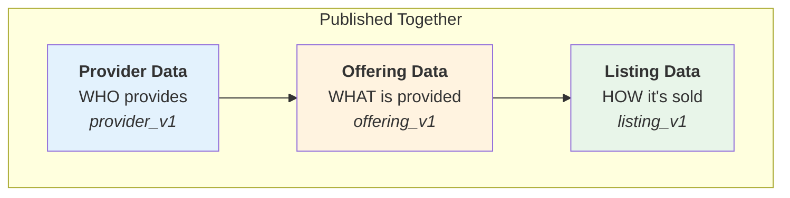

# CLI Reference

Complete command-line interface reference for `unitysvc_services` (alias: `usvc`).

## Global Options

```bash
unitysvc_services [OPTIONS] COMMAND [ARGS]...
# Or using the shorter alias:
usvc [OPTIONS] COMMAND [ARGS]...
```

### Options

-   `--install-completion` - Install shell completion
-   `--show-completion` - Show completion script
-   `--help` - Show help message

**Note:** All examples below use the shorter `usvc` alias. You can always replace `usvc` with `unitysvc_services` if preferred.

## Commands Overview

| Command     | Description                                      |
| ----------- | ------------------------------------------------ |
| `list`      | List data files in directory                     |
| `query`     | Query backend API for data                       |
| `publish`   | Publish data to backend                          |
| `unpublish` | Unpublish (delete) data from backend             |
| `update`    | Update local data files                          |
| `validate`  | Validate data consistency                        |
| `format`    | Format data files                                |
| `populate`  | Execute provider populate scripts                |
| `test`      | Test code examples with upstream API credentials |

**Note:** To create initial service data, use the [UnitySVC web interface](https://unitysvc.com) which provides a visual editor with validation. You can export your data for use with this SDK.

## list - List Local Files

List data files in local directory.

### list providers

```bash
unitysvc_services list providers [DATA_DIR]
```

**Arguments:**

-   `[DATA_DIR]` - Data directory (default: current directory)

**Examples:**

```bash
# List providers in current directory
usvc list providers

# List providers in specific directory
usvc list providers ./data
```

### list sellers

```bash
unitysvc_services list sellers [DATA_DIR]
```

### list offerings

```bash
unitysvc_services list offerings [DATA_DIR]
```

### list listings

```bash
unitysvc_services list listings [DATA_DIR]
```

**Output:**

-   Table format with file paths and key fields
-   Color-coded status indicators

## query - Query Backend

Query services for the current seller from UnitySVC backend API. Services are the identity layer that connects sellers to content versions (Provider, ServiceOffering, ServiceListing).

```bash
unitysvc_services query [OPTIONS]
```

**Options:**

-   `--format, -f {table|json}` - Output format (default: table)
-   `--fields FIELDS` - Comma-separated list of fields to display (default: id,name,status,seller_id,provider_id,offering_id,listing_id)
-   `--skip SKIP` - Number of records to skip for pagination (default: 0)
-   `--limit LIMIT` - Maximum number of records to return (default: 100)
-   `--status STATUS` - Filter by status (draft, pending, testing, active, rejected, suspended)

**Available Fields:**

id, name, display_name, status, seller_id, provider_id, offering_id, listing_id, revision_of, created_by_id, updated_by_id, created_at, updated_at

**Required Environment Variables:**

-   `UNITYSVC_BASE_URL` - Backend API URL
-   `UNITYSVC_API_KEY` - API key for authentication

**Examples:**

```bash
# Table output with default fields
usvc query

# JSON output
usvc query --format json

# Custom fields - show only specific columns
usvc query --fields id,name,status

# Filter by status
usvc query --status active

# Retrieve more than 100 records
usvc query --limit 500

# Pagination: get second page of 100 records
usvc query --skip 100 --limit 100
```

## publish - Publish Services to Backend

Publish services to UnitySVC backend. The publish command uses a **listing-centric** approach where each listing file triggers a unified publish of provider + offering + listing together.

### How Publishing Works

A **Service** in UnitySVC consists of three data components that are published together:



When you run `usvc publish`:

1. **Finds** all listing files (`listing_v1` schema) in the directory tree
2. For each listing, **locates** the offering file (`offering_v1`) in the same directory
3. **Locates** the provider file (`provider_v1`) in the parent directory
4. **Publishes** all three together to the `/seller/services` endpoint

This ensures atomic publishing - all three components are validated and published as a single unit.

**Usage:**

```bash
unitysvc_services publish [OPTIONS]
```

**Options:**

-   `--data-path, -d PATH` - Data directory or single listing file (default: current directory)
-   `--dryrun` - Preview what would be created/updated without making actual changes

**Required Environment Variables:**

-   `UNITYSVC_BASE_URL` - Backend API URL
-   `UNITYSVC_API_KEY` - API key for authentication (seller API key)

**Examples:**

```bash
# Publish all services from current directory
usvc publish

# Publish all services from custom directory
usvc publish --data-path ./data

# Publish a single service (specific listing file)
usvc publish --data-path ./data/my-provider/services/my-service/listing.json

# Preview changes before publishing (dryrun mode)
usvc publish --dryrun
```

**Dryrun Mode:**

The `--dryrun` option allows you to preview what would happen during publish without making actual changes to the backend. This is useful for:

-   Verifying which services would be created vs updated
-   Checking that all required files exist (provider, offering, listing)
-   Confirming changes before committing them

In dryrun mode:

-   No actual data is sent to the backend
-   Backend returns what action would be taken (create/update/unchanged)
-   Missing files are reported as errors
-   Summary shows what would happen if published

**Output Format:**

Publishing displays progress for each service and a summary table:

```bash
$ usvc publish
Publishing services from: /path/to/data
Backend URL: https://api.unitysvc.com/api/v1

  + Created service: listing-premium (offering: gpt-4, provider: openai)
  ~ Updated service: listing-basic (offering: gpt-4, provider: openai)
  = Unchanged service: listing-default (offering: claude-3, provider: anthropic)

Publishing Summary
╭──────────┬───────┬─────────┬─────────┬────────┬─────────┬─────────┬───────────╮
│ Type     │ Found │ Success │ Skipped │ Failed │ Created │ Updated │ Unchanged │
├──────────┼───────┼─────────┼─────────┼────────┼─────────┼─────────┼───────────┤
│ Services │ 3     │ 3       │         │        │ 1       │ 1       │ 1         │
╰──────────┴───────┴─────────┴─────────┴────────┴─────────┴─────────┴───────────╯

✓ All services published successfully!
```

**Status Indicators:**

| Symbol | Status | Meaning |
|--------|--------|---------|
| `+` | Created | New service published for the first time |
| `~` | Updated | Existing service updated with changes |
| `=` | Unchanged | Service already exists and is identical |
| `⊘` | Skipped | Service has draft status, not published |
| `✗` | Failed | Error during publishing |

**Skipped Services:**

Services are skipped (not published) when any of these conditions are true:

-   Provider has `status: draft` - provider still being configured
-   Offering has `status: draft` - offering still being configured
-   Listing has `status: draft` - listing still being configured

This allows you to work on services locally without publishing incomplete data. Set status to `ready` when you're ready to publish.

**Error Handling:**

If publishing fails for a service, the error is displayed and publishing continues with remaining services. Common errors:

-   Missing offering file in the same directory as the listing
-   Missing provider file in the parent directory
-   Invalid data that fails schema validation
-   Network/authentication errors

**Idempotent Publishing:**

Publishing is idempotent - running `usvc publish` multiple times with the same data will result in "unchanged" status for services that haven't changed. The backend tracks content hashes to detect changes efficiently.

**Override Files and Service ID Persistence:**

After a successful first publish, the SDK automatically saves the `service_id` to an override file:

```
listing.json       →  listing.override.json
listing.toml       →  listing.override.toml
```

Example override file content:
```json
{
  "service_id": "550e8400-e29b-41d4-a716-446655440000"
}
```

**Important:** The `service_id` is the stable identifier that subscriptions reference. When you first publish from a new repository or data directory, a **new Service is always created**, even if the content is identical to an existing service. The `service_id` in the override file ensures subsequent publishes update this specific service.

On subsequent publishes, the `service_id` is automatically loaded from the override file and included in the publish request, ensuring the existing service is **updated** rather than creating a new one.

**Publishing as New (Remove Existing Service ID):**

If you need to publish as a completely new service (ignoring any existing `service_id`), delete the override file before publishing:

```bash
# Remove override file to publish as new service
rm listing.override.json

# Publish - will create a new service with a new service_id
usvc publish --data-path ./my-provider/services/my-service/listing.json
```

Use cases for publishing as new:
- Accidentally deleted the service from the backend and need to recreate it
- Deploying to a different environment (staging vs production)
- Backend data was reset

**Cloning a Service:**

To create a variant or copy of an existing service (e.g., different pricing tier, different region):

```bash
# 1. Copy the listing file with a new name
cp listing.json listing-enterprise.json

# 2. Edit the new file to change name/configuration
#    - Change "name" field to a unique value (e.g., "enterprise")
#    - Modify pricing, parameters, etc. as needed

# 3. Publish the new listing (no override file exists, so creates new service)
usvc publish --data-path ./my-provider/services/my-service/listing-enterprise.json
```

**Important:** Each listing file should have a unique `name` field. The new listing will get its own `service_id` saved to `listing-enterprise.override.json`.

For multiple environment deployments, you can use different override files:
```bash
# Production override
listing.override.json          # service_id for production

# Staging override (manually managed or gitignored)
listing.staging.override.json  # service_id for staging
```

## unpublish - Unpublish from Backend

Unpublish (delete) data from UnitySVC backend. This command provides granular control over removing offerings, listings, providers, and sellers.

**⚠️ IMPORTANT CASCADE BEHAVIOR:**

-   **Deleting a seller** will automatically delete ALL associated listings from that seller (across all providers and offerings)
-   **Deleting a provider** will automatically delete ALL associated offerings AND listings from that provider
-   **Deleting an offering** will automatically delete ALL associated listings for that offering
-   **Deleting a listing** only removes that specific listing

By default, deletion is blocked if there are active subscriptions. Use `--force` to override this protection.

**Common Options:**

-   `--dryrun` - Preview what would be deleted without actually deleting
-   `--force` - Force deletion even with active subscriptions
-   `--yes, -y` - Skip confirmation prompt

**Required Environment Variables:**

-   `UNITYSVC_BASE_URL` - Backend API URL
-   `UNITYSVC_API_KEY` - API key for authentication

### unpublish offerings

Unpublish (delete) service offerings from backend.

**⚠️ CASCADE WARNING:** Deleting an offering will also delete ALL associated listings and subscriptions.

```bash
unitysvc_services unpublish offerings [DATA_DIR] [OPTIONS]
```

**Arguments:**

-   `[DATA_DIR]` - Directory containing offering files (default: current directory)

**Options:**

-   `--services, -s NAMES` - Comma-separated list of service names to unpublish
-   `--provider, -p NAME` - Unpublish offerings from specific provider
-   `--dryrun` - Show what would be deleted without actually deleting
-   `--force` - Force deletion even with active subscriptions
-   `--yes, -y` - Skip confirmation prompt

**Examples:**

```bash
# Dry-run to see what would be deleted
usvc unpublish offerings --services "gpt-4" --dryrun

# Delete specific offering
usvc unpublish offerings --services "gpt-4"

# Delete multiple offerings
usvc unpublish offerings --services "gpt-4,gpt-3.5-turbo"

# Delete all offerings from a provider
usvc unpublish offerings --provider openai

# Force delete (ignore active subscriptions)
usvc unpublish offerings --services "gpt-4" --force --yes
```

**Output:**

Shows a table of offerings to be deleted, including service name, provider, and offering ID. After deletion, displays cascade information (how many listings and subscriptions were also deleted).

### unpublish listings

Unpublish (delete) a specific service listing from backend.

```bash
unitysvc_services unpublish listings <listing-id> [OPTIONS]
```

**Arguments:**

-   `<listing-id>` - UUID of the listing to unpublish (required)

**Options:**

-   `--dryrun` - Show what would be deleted without actually deleting
-   `--force` - Force deletion even with active subscriptions
-   `--yes, -y` - Skip confirmation prompt

**Examples:**

```bash
# Dry-run
usvc unpublish listings abc-123-def-456 --dryrun

# Delete listing
usvc unpublish listings abc-123-def-456

# Force delete without confirmation
usvc unpublish listings abc-123-def-456 --force --yes
```

**Output:**

Shows deletion confirmation and number of subscriptions deleted (if any).

### unpublish providers

Unpublish (delete) a provider from backend.

**⚠️ CASCADE WARNING:** Deleting a provider will delete the provider AND ALL associated offerings, listings, and subscriptions.

```bash
unitysvc_services unpublish providers <provider-name> [OPTIONS]
```

**Arguments:**

-   `<provider-name>` - Name of the provider to unpublish (required)

**Options:**

-   `--dryrun` - Show what would be deleted without actually deleting
-   `--force` - Force deletion even with active subscriptions
-   `--yes, -y` - Skip confirmation prompt

**Examples:**

```bash
# Dry-run to see impact
usvc unpublish providers openai --dryrun

# Delete provider and all its offerings/listings
usvc unpublish providers openai

# Force delete without confirmation
usvc unpublish providers openai --force --yes
```

**Output:**

Shows deletion summary including counts of:

-   Offerings deleted
-   Listings deleted
-   Subscriptions deleted

### unpublish sellers

Unpublish (delete) a seller from backend.

**⚠️ CASCADE WARNING:** Deleting a seller will delete the seller AND ALL associated listings and subscriptions. Note that this does NOT delete providers or offerings (which can be resold by other sellers), only the listings tied to this specific seller.

```bash
unitysvc_services unpublish sellers <seller-name> [OPTIONS]
```

**Arguments:**

-   `<seller-name>` - Name of the seller to unpublish (required)

**Options:**

-   `--dryrun` - Show what would be deleted without actually deleting
-   `--force` - Force deletion even with active subscriptions
-   `--yes, -y` - Skip confirmation prompt

**Examples:**

```bash
# Dry-run to see impact
usvc unpublish sellers my-company --dryrun

# Delete seller and all its listings
usvc unpublish sellers my-company

# Force delete without confirmation
usvc unpublish sellers my-company --force --yes
```

**Output:**

Shows deletion summary including counts of:

-   Providers deleted (if seller owns providers)
-   Offerings deleted (if seller owns providers with offerings)
-   Listings deleted
-   Subscriptions deleted

**Important Notes:**

-   Always use `--dryrun` first to preview the impact before actual deletion
-   Cascade deletions are permanent and cannot be undone
-   Active subscriptions will block deletion unless `--force` is used
-   Use `--yes` flag in automated scripts to skip interactive confirmation

## update - Update Local Files

Update fields in local data files.

### update offering

```bash
unitysvc_services update offering --name <name> [OPTIONS]
```

**Options:**

-   `--name, -n NAME` - Service offering name (required)
-   `--status, -s STATUS` - New status (draft|ready|deprecated)
-   `--display-name NAME` - New display name
-   `--description TEXT` - New description
-   `--data-dir, -d PATH` - Data directory (default: current directory)

**Examples:**

```bash
# Update status
usvc update offering --name my-service --status ready

# Update multiple fields
usvc update offering --name my-service \
  --status ready \
  --display-name "My Updated Service"
```

### update listing

```bash
unitysvc_services update listing --services <name> [OPTIONS]
```

**Options:**

-   `--services, -n NAME` - Service name (required)
-   `--status, -s STATUS` - New status (draft|ready|deprecated)
-   `--seller SELLER` - Filter by seller name
-   `--data-dir, -d PATH` - Data directory (default: current directory)

**Listing Status Values:**

Seller-accessible statuses (can be set via CLI):

-   `draft` - Listing is being worked on, skipped during publish (won't be sent to backend)
-   `ready` - Listing is complete and ready for admin review/testing
-   `deprecated` - Seller marks service as retired/replaced

Note: Admin-managed workflow statuses (upstream_ready, downstream_ready, in_service) are set by the backend admin after testing and validation, not through the CLI tool.

**Examples:**

```bash
# Update listing status
usvc update listing --services my-service --status ready

# Update for specific seller
usvc update listing \
  --services my-service \
  --status in_service \
  --seller svcreseller
```

## validate - Validate Data

Validate data consistency and schema compliance.

```bash
unitysvc_services validate [DATA_DIR]
```

**Arguments:**

-   `[DATA_DIR]` - Data directory (default: current directory)

**Checks:**

-   Schema compliance
-   Service name uniqueness
-   Listing references
-   Provider/service name matching
-   File path validity
-   Seller uniqueness

**Examples:**

```bash
# Validate current directory
usvc validate

# Validate specific directory
usvc validate ./data
```

**Exit Codes:**

-   `0` - All validations passed
-   `1` - Validation errors found

## format - Format Files

Format data files to match pre-commit requirements.

```bash
unitysvc_services format [DATA_DIR] [OPTIONS]
```

**Arguments:**

-   `[DATA_DIR]` - Data directory (default: current directory)

**Options:**

-   `--check` - Check formatting without modifying files

**Actions:**

-   Format JSON with 2-space indentation
-   Remove trailing whitespace
-   Ensure single newline at end of file
-   Sort JSON keys

**Examples:**

```bash
# Format all files in current directory
usvc format

# Check formatting without changes
usvc format --check

# Format specific directory
usvc format ./data
```

**Exit Codes:**

-   `0` - All files formatted or already formatted
-   `1` - Formatting errors or files need formatting (with --check)

## populate - Generate Services

Execute provider populate scripts to auto-generate service data.

```bash
unitysvc_services populate [DATA_DIR] [OPTIONS]
```

**Arguments:**

-   `[DATA_DIR]` - Data directory (default: current directory)

**Options:**

-   `--provider, -p NAME` - Only populate specific provider
-   `--dry-run` - Show what would execute without running

**Requirements:**

-   Provider file must have `services_populator` configuration
-   Script specified in `services_populator.command`
-   Environment variables from `services_populator.envs`

**Examples:**

```bash
# Run all populate scripts
usvc populate

# Run for specific provider
usvc populate --provider openai

# Dry run
usvc populate --dry-run
```

## test - Test Code Examples

Test code examples with upstream API credentials. This command discovers code examples from listing files and executes them with provider credentials.

**How it works:**

1. Scans for all listing files (schema: listing_v1)
2. Extracts code example documents (category = `code_examples`)
3. Loads provider credentials from provider files
4. Renders Jinja2 templates with listing, offering, provider, and seller data
5. Sets environment variables (API_KEY, BASE_URL) from provider credentials
6. Executes code examples using appropriate interpreter (python3, node, bash)
7. Validates results based on exit code and optional `expect` field

### test list

List available code examples without running them.

```bash
unitysvc_services test list [DATA_DIR] [OPTIONS]
```

**Arguments:**

-   `[DATA_DIR]` - Data directory (default: current directory)

**Options:**

-   `--provider, -p NAME` - Only list code examples for a specific provider
-   `--services, -s PATTERNS` - Comma-separated list of service patterns (supports wildcards)

**Output:**

-   Table showing: Service name, Provider, Title, File type, Relative file path

**Examples:**

```bash
# List all code examples
usvc test list

# List for specific provider
usvc test list --provider fireworks

# List for specific services (with wildcards)
usvc test list --services "llama*,gpt-4*"

# List from custom directory
usvc test list ./data
```

### test run

Execute code examples and report results.

```bash
unitysvc_services test run [DATA_DIR] [OPTIONS]
```

**Arguments:**

-   `[DATA_DIR]` - Data directory (default: current directory)

**Options:**

-   `--provider, -p NAME` - Only test code examples for a specific provider
-   `--services, -s PATTERNS` - Comma-separated list of service patterns (supports wildcards)
-   `--test-file, -t FILENAME` - Only run a specific test file by filename (e.g., 'code-example.py.j2')
-   `--verbose, -v` - Show detailed output including stdout/stderr from scripts
-   `--force, -f` - Force rerun all tests, ignoring existing .out and .err files
-   `--fail-fast, -x` - Stop testing on first failure

\*\*Test Pass Criteria:

-   Exit code is 0 AND
-   If `expect` field is defined in document: expected string found in stdout
-   If `expect` field is NOT defined: only exit code matters

**Test Result Caching:**

By default, successful test results are cached to avoid re-running tests unnecessarily:

-   When a test passes, `.out` and `.err` files are saved in the same directory as the listing file
-   On subsequent runs, tests with existing result files are skipped
-   Use `--force` to ignore cached results and re-run all tests
-   Failed tests are always re-run (their output goes to current directory with `failed_` prefix)

**Failed Test Output:**

When a test fails, the rendered content is saved to the current directory:

-   Filename format: `failed_{service}_{listing}_{filename}.{out|err|extension}`
-   `.out` file: stdout from the test
-   `.err` file: stderr from the test
-   Script file: Full rendered template content with environment variables
-   Can be run directly to reproduce the issue

**Successful Test Output:**

When a test passes, output files are saved in the listing directory:

-   Filename format: `{service}_{listing}_{filename}.{out|err}`
-   Saved alongside the listing definition file
-   Used to skip re-running tests unless `--force` is specified

\*\*Examples:

```bash
# Test all code examples
usvc test run

# Test specific provider
usvc test run --provider fireworks

# Test specific services (with wildcards)
usvc test run --services "llama*,gpt-4*"

# Test single service
usvc test run --services "llama-3-1-405b-instruct"

# Test specific file
usvc test run --test-file "code-example.py.j2"

# Combine filters
usvc test run --provider fireworks --services "llama*"

# Show detailed output
usvc test run --verbose

# Force rerun all tests (ignore cached results)
usvc test run --force

# Stop on first failure (useful for quick feedback)
usvc test run --fail-fast

# Combine options
usvc test run --force --fail-fast --verbose
usvc test run -f -x -v  # Short form
```

**Interpreter Detection:**

-   `.py` files: Uses `python3` (falls back to `python`)
-   `.js` files: Uses `node` (Node.js required)
-   `.sh` files: Uses `bash`
-   Other files: Checks shebang line for interpreter

**Exit Codes:**

-   `0` - All tests passed
-   `1` - One or more tests failed

See [Creating Code Examples](https://unitysvc-services.readthedocs.io/en/latest/code-examples/) for detailed guide on creating and debugging code examples.

## Environment Variables

| Variable            | Description            | Used By        |
| ------------------- | ---------------------- | -------------- |
| `UNITYSVC_BASE_URL` | Backend API URL        | query, publish |
| `UNITYSVC_API_KEY`  | API authentication key | query, publish |

**Example:**

```bash
export UNITYSVC_BASE_URL=https://api.unitysvc.com/api/v1
export UNITYSVC_API_KEY=your-api-key

usvc validate
usvc publish providers
```

## Exit Codes

| Code | Meaning                           |
| ---- | --------------------------------- |
| 0    | Success                           |
| 1    | Error (validation, publish, etc.) |

## Shell Completion

### Install Completion

```bash
# Bash
usvc --install-completion bash

# Zsh
usvc --install-completion zsh

# Fish
usvc --install-completion fish
```

### Show Completion Script

```bash
usvc --show-completion
```

## Common Workflows

### Creating Data

Create data using the web interface at [unitysvc.com](https://unitysvc.com), then export for SDK use:

1. Sign in to unitysvc.com
2. Create your Provider, Offerings, and Listings using the visual editor
3. Export your data as JSON/TOML files
4. Place files in the expected directory structure

Alternatively, create files manually following the [File Schemas](file-schemas.md) documentation.

### Full Publish Flow

```bash
# Set environment
export UNITYSVC_BASE_URL=https://api.unitysvc.com/api/v1
export UNITYSVC_API_KEY=your-key

# Validate and format
usvc validate
usvc format

# Preview changes before publishing (recommended)
cd data
usvc publish --dryrun

# If preview looks good, publish all (handles order automatically)
usvc publish

# Verify
usvc query
```

### Update and Republish

```bash
# Update local file
usvc update offering --name my-service --status ready

# Validate
usvc validate

# Preview changes
usvc publish offerings --dryrun

# Publish changes
usvc publish offerings
```

### Automated Generation

```bash
# Generate services
usvc populate

# Validate and format
usvc validate
usvc format

# Preview generated data
cd data
usvc publish --dryrun

# Publish all
usvc publish
```

## See Also

-   [Getting Started](getting-started.md) - First steps tutorial
-   [Workflows](workflows.md) - Common usage patterns
-   [Data Structure](data-structure.md) - File organization rules
-   [Documenting Service Listings](documenting-services.md) - Add documentation to services
-   [Creating Code Examples](code-examples.md) - Develop and test code examples
-   [API Reference](api-reference.md) - Python API documentation
