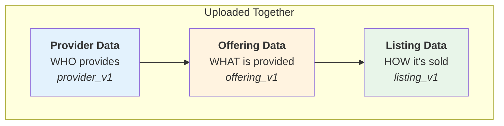

# CLI Reference

Complete command-line interface reference for `unitysvc_services` (alias: `usvc`).

## Global Options

```bash
unitysvc_services [OPTIONS] COMMAND [ARGS]...
# Or using the shorter alias:
usvc [OPTIONS] COMMAND [ARGS]...
```

### Options

- `--install-completion` - Install shell completion
- `--show-completion` - Show completion script
- `--help` - Show help message

**Note:** All examples below use the shorter `usvc` alias. You can always replace `usvc` with `unitysvc_services` if preferred.

## Commands Overview

The CLI is organized into two main command groups with a clear separation of concerns:

### Local Data Operations (`usvc data`)

Work with local data files - can be used offline without API credentials.

| Command      | Description                                         |
| ------------ | --------------------------------------------------- |
| `validate`   | Validate data files against schemas                 |
| `format`     | Format/prettify data files                          |
| `populate`   | Generate data files from provider scripts           |
| `list`       | List local data files (services, providers, etc.)   |
| `show`       | Show details of a local data object                 |
| `list-tests` | List code examples in local data                    |
| `run-tests`  | Run code examples locally with upstream credentials |
| `show-test`  | Show details of a local test                        |

### Remote Service Operations (`usvc services`)

Manage services on the backend - can be run from anywhere with the right API key.

| Command       | Description                                   |
| ------------- | --------------------------------------------- |
| `upload`      | Upload services to backend (draft status)     |
| `list`        | List deployed services on backend             |
| `show`        | Show details of a deployed service            |
| `submit`      | Submit draft service for ops review           |
| `deprecate`   | Deprecate an active service                   |
| `delete`      | Delete a service from backend                 |
| `list-tests`  | List tests for deployed services              |
| `show-test`   | Show details of a test for a deployed service |
| `run-tests`   | Run tests via gateway (backend execution)     |
| `skip-test`   | Mark a code example test as skipped           |
| `unskip-test` | Remove skip status from a test                |

**Note:** To create initial service data, use the [UnitySVC web interface](https://unitysvc.com) which provides a visual editor with validation. You can export your data for use with this SDK.

## usvc data - Local Data Operations

Commands for working with local data files. These commands work offline and don't require API credentials.

### usvc data list - List Local Files

List data files in local directory.

#### usvc data list providers

```bash
usvc data list providers [DATA_DIR]
```

**Arguments:**

- `[DATA_DIR]` - Data directory (default: current directory)

**Examples:**

```bash
# List providers in current directory
usvc data list providers

# List providers in specific directory
usvc data list providers ./data
```

#### usvc data list sellers

```bash
usvc data list sellers [DATA_DIR]
```

#### usvc data list offerings

```bash
usvc data list offerings [DATA_DIR]
```

#### usvc data list listings

```bash
usvc data list listings [DATA_DIR]
```

#### usvc data list services

```bash
usvc data list services [DATA_DIR]
```

List all services with their provider, offering, and listing files.

**Output:**

- Table format with file paths and key fields
- Color-coded status indicators

## usvc services - Remote Service Operations

Commands for managing services on the backend. These commands require API credentials and can be run from anywhere.

### usvc services list - Query Backend

Query services for the current seller from UnitySVC backend API. Services are the identity layer that connects sellers to content versions (Provider, ServiceOffering, ServiceListing).

```bash
usvc services list [OPTIONS]
```

**Options:**

- `--format, -f {table|json|tsv|csv}` - Output format (default: table)
- `--fields FIELDS` - Comma-separated list of fields to display (default: id,name,status,seller_id,provider_id,offering_id,listing_id)
- `--skip SKIP` - Number of records to skip for pagination (default: 0)
- `--limit LIMIT` - Maximum number of records to return (default: 100)
- `--status STATUS` - Filter by status (draft, pending, testing, active, rejected, suspended)

**Available Fields:**

id, name, display_name, status, seller_id, provider_id, offering_id, listing_id, revision_of, created_by_id, updated_by_id, created_at, updated_at

**Required Environment Variables:**

- `UNITYSVC_BASE_URL` - Backend API URL
- `UNITYSVC_API_KEY` - API key for authentication

**Examples:**

```bash
# Table output with default fields
usvc services list

# JSON output
usvc services list --format json

# Custom fields - show only specific columns
usvc services list --fields id,name,status

# Filter by status
usvc services list --status active

# Retrieve more than 100 records
usvc services list --limit 500

# Pagination: get second page of 100 records
usvc services list --skip 100 --limit 100
```

### usvc services upload - Upload Services to Backend

Upload services to UnitySVC backend. The upload command uses a **listing-centric** approach where each listing file triggers a unified upload of provider + offering + listing together.

#### How Uploading Works

A **Service** in UnitySVC consists of three data components that are uploaded together:



When you run `usvc services upload`:

1. **Finds** all listing files (`listing_v1` schema) in the directory tree
2. For each listing, **locates** the offering file (`offering_v1`) in the same directory
3. **Locates** the provider file (`provider_v1`) in the parent directory
4. **Uploads** all three together to the `/seller/services` endpoint

This ensures atomic uploading - all three components are validated and uploaded as a single unit.

**Usage:**

```bash
usvc services upload [OPTIONS]
```

**Options:**

- `--data-path, -d PATH` - Data directory or single listing file (default: current directory)
- `--dryrun` - Preview what would be created/updated without making actual changes

**Required Environment Variables:**

- `UNITYSVC_BASE_URL` - Backend API URL
- `UNITYSVC_API_KEY` - API key for authentication (seller API key)

**Examples:**

```bash
# Upload all services from current directory
usvc services upload

# Upload all services from custom directory
usvc services upload --data-path ./data

# Upload a single service (specific listing file)
usvc services upload --data-path ./data/my-provider/services/my-service/listing.json

# Preview changes before uploading (dryrun mode)
usvc services upload --dryrun
```

**Dryrun Mode:**

The `--dryrun` option allows you to preview what would happen during upload without making actual changes to the backend. This is useful for:

- Verifying which services would be created vs updated
- Checking that all required files exist (provider, offering, listing)
- Confirming changes before committing them

In dryrun mode:

- No actual data is sent to the backend
- Backend returns what action would be taken (create/update/unchanged)
- Missing files are reported as errors
- Summary shows what would happen if uploaded

**Output Format:**

Uploading displays progress for each service and a summary table:

```bash
$ usvc services upload
Uploading services from: /path/to/data
Backend URL: https://api.unitysvc.com/v1

  + Created service: listing-premium (offering: gpt-4, provider: openai)
  ~ Updated service: listing-basic (offering: gpt-4, provider: openai)
  = Unchanged service: listing-default (offering: claude-3, provider: anthropic)

Upload Summary
╭──────────┬───────┬─────────┬─────────┬────────┬─────────┬─────────┬───────────╮
│ Type     │ Found │ Success │ Skipped │ Failed │ Created │ Updated │ Unchanged │
├──────────┼───────┼─────────┼─────────┼────────┼─────────┼─────────┼───────────┤
│ Services │ 3     │ 3       │         │        │ 1       │ 1       │ 1         │
╰──────────┴───────┴─────────┴─────────┴────────┴─────────┴─────────┴───────────╯

✓ All services uploaded successfully!
```

**Status Indicators:**

| Symbol | Status    | Meaning                                 |
| ------ | --------- | --------------------------------------- |
| `+`    | Created   | New service uploaded for the first time |
| `~`    | Updated   | Existing service updated with changes   |
| `=`    | Unchanged | Service already exists and is identical |
| `⊘`    | Skipped   | Service has draft status, not uploaded  |
| `✗`    | Failed    | Error during uploading                  |

**Skipped Services:**

Services are skipped (not uploaded) when any of these conditions are true:

- Provider has `status: draft` - provider still being configured
- Offering has `status: draft` - offering still being configured
- Listing has `status: draft` - listing still being configured

This allows you to work on services locally without uploading incomplete data. Set status to `ready` when you're ready to upload.

**Error Handling:**

If uploading fails for a service, the error is displayed and uploading continues with remaining services. Common errors:

- Missing offering file in the same directory as the listing
- Missing provider file in the parent directory
- Invalid data that fails schema validation
- Network/authentication errors

**Idempotent Uploading:**

Uploading is idempotent - running `usvc services upload` multiple times with the same data will result in "unchanged" status for services that haven't changed. The backend tracks content hashes to detect changes efficiently.

**Override Files and Service ID Persistence:**

After a successful first upload, the SDK automatically saves the `service_id` to an override file:

```
listing.json       →  listing.override.json
listing.toml       →  listing.override.toml
```

Example override file content:

```json
{
    "service_id": "550e8400-e29b-41d4-a716-446655440000"
}
```

**Important:** The `service_id` is the stable identifier that subscriptions reference. When you first upload from a new repository or data directory, a **new Service is always created**, even if the content is identical to an existing service. The `service_id` in the override file ensures subsequent uploads update this specific service.

On subsequent uploads, the `service_id` is automatically loaded from the override file and included in the upload request, ensuring the existing service is **updated** rather than creating a new one.

**Uploading as New (Remove Existing Service ID):**

If you need to upload as a completely new service (ignoring any existing `service_id`), delete the override file before uploading:

```bash
# Remove override file to upload as new service
rm listing.override.json

# Upload - will create a new service with a new service_id
usvc services upload --data-path ./my-provider/services/my-service/listing.json
```

Use cases for uploading as new:

- Accidentally deleted the service from the backend and need to recreate it
- Deploying to a different environment (staging vs production)
- Backend data was reset

**Cloning a Service:**

To create a variant or copy of an existing service (e.g., different pricing tier, different region):

```bash
# 1. Copy the listing file with a new name
cp listing.json listing-enterprise.json

# 2. Edit the new file to change name/configuration
#    - Change "name" field to a unique value (e.g., "enterprise")
#    - Modify pricing, parameters, etc. as needed

# 3. Upload the new listing (no override file exists, so creates new service)
usvc services upload --data-path ./my-provider/services/my-service/listing-enterprise.json
```

**Important:** Each listing file should have a unique `name` field. The new listing will get its own `service_id` saved to `listing-enterprise.override.json`.

For multiple environment deployments, you can use different override files:

```bash
# Production override
listing.override.json          # service_id for production

# Staging override (manually managed or gitignored)
listing.staging.override.json  # service_id for staging
```

### usvc services deprecate - Deprecate a Service

Deprecate an active service. Deprecated services remain accessible but are marked as deprecated.

```bash
usvc services deprecate <SERVICE_ID> [OPTIONS]
```

**Arguments:**

- `<SERVICE_ID>` - UUID or partial UUID of the service to deprecate (required)

**Options:**

- `--yes, -y` - Skip confirmation prompt

**Examples:**

```bash
# Deprecate a service (with confirmation)
usvc services deprecate abc123-uuid

# Deprecate without confirmation
usvc services deprecate abc123-uuid -y
```

### usvc services delete - Delete a Service

Permanently delete a service from the backend.

```bash
usvc services delete <SERVICE_ID> [OPTIONS]
```

**Arguments:**

- `<SERVICE_ID>` - UUID or partial UUID of the service to delete (required)

**Options:**

- `--yes, -y` - Skip confirmation prompt

**Examples:**

```bash
# Delete a service (with confirmation)
usvc services delete abc123-uuid

# Delete without confirmation
usvc services delete abc123-uuid -y
```

### usvc services submit - Submit for Review

Submit a draft service for ops review.

```bash
usvc services submit <SERVICE_ID>
```

**Arguments:**

- `<SERVICE_ID>` - UUID or partial UUID of the service to submit (required)

**Examples:**

```bash
# Submit a service for review
usvc services submit abc123-uuid
```

**Required Environment Variables:**

- `UNITYSVC_BASE_URL` - Backend API URL
- `UNITYSVC_API_KEY` - API key for authentication

---

## usvc services test commands

Commands for managing and running tests on deployed services via the gateway.

### usvc services list-tests

List tests for deployed services. If no service ID is specified, lists tests for all services.

```bash
usvc services list-tests [SERVICE_ID] [OPTIONS]
```

**Arguments:**

- `[SERVICE_ID]` - UUID or partial UUID of the service (optional, lists all if omitted)

**Options:**

- `--format, -f TEXT` - Output format: table, json, tsv, csv (default: table)

**Examples:**

```bash
# List tests for all services
usvc services list-tests

# List tests for specific service
usvc services list-tests abc123

# JSON output
usvc services list-tests --format json
```

### usvc services show-test

Show details of a test for a deployed service.

```bash
usvc services show-test <SERVICE_ID> -t <TEST_TITLE> [OPTIONS]
```

**Arguments:**

- `<SERVICE_ID>` - UUID or partial UUID of the service (required)

**Options:**

- `--test-title, -t TEXT` - Test title (required)
- `--format, -f TEXT` - Output format: json, table, tsv, csv (default: json)

**Examples:**

```bash
usvc services show-test abc123 -t "Python Example"
```

### usvc services run-tests

Run tests **locally** on your machine. Fetches test scripts from the backend, executes them with your local environment variables, and reports results back to the platform.

**Environment Setup Required:**

Before running tests, you must set up your environment with gateway credentials:

```bash
# Set gateway URL and your customer API key
export BASE_URL="https://gateway.unitysvc.com"
export API_KEY="svcpass_your_customer_api_key"
```

To get an API key:

1. Create a customer account (or use an existing one)
2. Generate a customer API key for that account
3. Export it as `API_KEY` in your shell

```bash
usvc services run-tests <SERVICE_ID> [OPTIONS]
```

**Arguments:**

- `<SERVICE_ID>` - UUID or partial UUID of the service (required)

**Options:**

- `--test-title, -t TEXT` - Run specific test by title (runs all if not specified)
- `--doc-id, -d TEXT` - Run specific test by document ID (supports partial IDs)
- `--verbose, -v` - Show detailed output including stdout/stderr
- `--force` - Force rerun (ignore previous success status)
- `--fail-fast, -x` - Stop on first failure
- `--timeout INT` - Execution timeout in seconds (default: 30)

**Examples:**

```bash
# Set up environment first
export BASE_URL="https://gateway.unitysvc.com"
export API_KEY="svcpass_your_customer_api_key"

# Run all tests for a service
usvc services run-tests abc123

# Run specific test by title
usvc services run-tests abc123 -t "Demo"

# Run specific test by document ID
usvc services run-tests abc123 -d def456

# Verbose output
usvc services run-tests abc123 -v

# Force rerun even if previously successful
usvc services run-tests abc123 --force

# Stop on first failure
usvc services run-tests abc123 --fail-fast
```

**Note:** This differs from web-based testing (frontend "Test" button) which uses the platform's ops customer API key. Local CLI testing gives you full control over the test environment but requires you to manage your own credentials.

### usvc services skip-test

Mark a code example test as skipped. Skipped tests are excluded from test runs. Note: Connectivity tests cannot be skipped.

```bash
usvc services skip-test <SERVICE_ID> -t <TEST_TITLE>
```

**Arguments:**

- `<SERVICE_ID>` - UUID or partial UUID of the service (required)

**Options:**

- `--test-title, -t TEXT` - Test title (required)

**Examples:**

```bash
usvc services skip-test abc123 -t "Demo that requires GPU"
```

### usvc services unskip-test

Remove skip status from a test, making it eligible for execution again.

```bash
usvc services unskip-test <SERVICE_ID> -t <TEST_TITLE>
```

**Arguments:**

- `<SERVICE_ID>` - UUID or partial UUID of the service (required)

**Options:**

- `--test-title, -t TEXT` - Test title (required)

**Examples:**

```bash
usvc services unskip-test abc123 -t "Demo that requires GPU"
```

---

## Legacy unpublish commands (deprecated)

These commands are deprecated. Use `usvc services deprecate` and `usvc services delete` instead.

### unpublish - Unpublish from Backend

Unpublish (delete) data from UnitySVC backend. This command provides granular control over removing offerings, listings, providers, and sellers.

**⚠️ IMPORTANT CASCADE BEHAVIOR:**

- **Deleting a seller** will automatically delete ALL associated listings from that seller (across all providers and offerings)
- **Deleting a provider** will automatically delete ALL associated offerings AND listings from that provider
- **Deleting an offering** will automatically delete ALL associated listings for that offering
- **Deleting a listing** only removes that specific listing

By default, deletion is blocked if there are active subscriptions. Use `--force` to override this protection.

**Common Options:**

- `--dryrun` - Preview what would be deleted without actually deleting
- `--force` - Force deletion even with active subscriptions
- `--yes, -y` - Skip confirmation prompt

**Required Environment Variables:**

- `UNITYSVC_BASE_URL` - Backend API URL
- `UNITYSVC_API_KEY` - API key for authentication

### unpublish offerings

Unpublish (delete) service offerings from backend.

**⚠️ CASCADE WARNING:** Deleting an offering will also delete ALL associated listings and subscriptions.

```bash
unitysvc_services unpublish offerings [DATA_DIR] [OPTIONS]
```

**Arguments:**

- `[DATA_DIR]` - Directory containing offering files (default: current directory)

**Options:**

- `--services, -s NAMES` - Comma-separated list of service names to unpublish
- `--provider, -p NAME` - Unpublish offerings from specific provider
- `--dryrun` - Show what would be deleted without actually deleting
- `--force` - Force deletion even with active subscriptions
- `--yes, -y` - Skip confirmation prompt

**Examples:**

```bash
# Dry-run to see what would be deleted
usvc unpublish offerings --services "gpt-4" --dryrun

# Delete specific offering
usvc unpublish offerings --services "gpt-4"

# Delete multiple offerings
usvc unpublish offerings --services "gpt-4,gpt-3.5-turbo"

# Delete all offerings from a provider
usvc unpublish offerings --provider openai

# Force delete (ignore active subscriptions)
usvc unpublish offerings --services "gpt-4" --force --yes
```

**Output:**

Shows a table of offerings to be deleted, including service name, provider, and offering ID. After deletion, displays cascade information (how many listings and subscriptions were also deleted).

### unpublish listings

Unpublish (delete) a specific service listing from backend.

```bash
unitysvc_services unpublish listings <listing-id> [OPTIONS]
```

**Arguments:**

- `<listing-id>` - UUID of the listing to unpublish (required)

**Options:**

- `--dryrun` - Show what would be deleted without actually deleting
- `--force` - Force deletion even with active subscriptions
- `--yes, -y` - Skip confirmation prompt

**Examples:**

```bash
# Dry-run
usvc unpublish listings abc-123-def-456 --dryrun

# Delete listing
usvc unpublish listings abc-123-def-456

# Force delete without confirmation
usvc unpublish listings abc-123-def-456 --force --yes
```

**Output:**

Shows deletion confirmation and number of subscriptions deleted (if any).

### unpublish providers

Unpublish (delete) a provider from backend.

**⚠️ CASCADE WARNING:** Deleting a provider will delete the provider AND ALL associated offerings, listings, and subscriptions.

```bash
unitysvc_services unpublish providers <provider-name> [OPTIONS]
```

**Arguments:**

- `<provider-name>` - Name of the provider to unpublish (required)

**Options:**

- `--dryrun` - Show what would be deleted without actually deleting
- `--force` - Force deletion even with active subscriptions
- `--yes, -y` - Skip confirmation prompt

**Examples:**

```bash
# Dry-run to see impact
usvc unpublish providers openai --dryrun

# Delete provider and all its offerings/listings
usvc unpublish providers openai

# Force delete without confirmation
usvc unpublish providers openai --force --yes
```

**Output:**

Shows deletion summary including counts of:

- Offerings deleted
- Listings deleted
- Subscriptions deleted

### unpublish sellers

Unpublish (delete) a seller from backend.

**⚠️ CASCADE WARNING:** Deleting a seller will delete the seller AND ALL associated listings and subscriptions. Note that this does NOT delete providers or offerings (which can be resold by other sellers), only the listings tied to this specific seller.

```bash
unitysvc_services unpublish sellers <seller-name> [OPTIONS]
```

**Arguments:**

- `<seller-name>` - Name of the seller to unpublish (required)

**Options:**

- `--dryrun` - Show what would be deleted without actually deleting
- `--force` - Force deletion even with active subscriptions
- `--yes, -y` - Skip confirmation prompt

**Examples:**

```bash
# Dry-run to see impact
usvc unpublish sellers my-company --dryrun

# Delete seller and all its listings
usvc unpublish sellers my-company

# Force delete without confirmation
usvc unpublish sellers my-company --force --yes
```

**Output:**

Shows deletion summary including counts of:

- Providers deleted (if seller owns providers)
- Offerings deleted (if seller owns providers with offerings)
- Listings deleted
- Subscriptions deleted

**Important Notes:**

- Always use `--dryrun` first to preview the impact before actual deletion
- Cascade deletions are permanent and cannot be undone
- Active subscriptions will block deletion unless `--force` is used
- Use `--yes` flag in automated scripts to skip interactive confirmation

## Editing Local Files

To update fields in local data files, edit the JSON or TOML files directly. This file-based approach gives you full control and integrates naturally with version control.

**Listing Status Values:**

Seller-accessible statuses:

- `draft` - Listing is being worked on, skipped during upload (won't be sent to backend)
- `ready` - Listing is complete and ready for admin review/testing
- `deprecated` - Seller marks service as retired/replaced

Note: Admin-managed workflow statuses are set by the backend admin after testing and validation.

### usvc data validate - Validate Data

Validate data consistency and schema compliance.

```bash
usvc data validate [DATA_DIR]
```

**Arguments:**

- `[DATA_DIR]` - Data directory (default: current directory)

**Checks:**

- Schema compliance
- Service name uniqueness
- Listing references
- Provider/service name matching
- File path validity
- Seller uniqueness

**Examples:**

```bash
# Validate current directory
usvc data validate

# Validate specific directory
usvc data validate ./data
```

**Exit Codes:**

- `0` - All validations passed
- `1` - Validation errors found

### usvc data format - Format Files

Format data files to match pre-commit requirements.

```bash
usvc data format [DATA_DIR] [OPTIONS]
```

**Arguments:**

- `[DATA_DIR]` - Data directory (default: current directory)

**Options:**

- `--check` - Check formatting without modifying files

**Actions:**

- Format JSON with 2-space indentation
- Remove trailing whitespace
- Ensure single newline at end of file
- Sort JSON keys

**Examples:**

```bash
# Format all files in current directory
usvc data format

# Check formatting without changes
usvc data format --check

# Format specific directory
usvc data format ./data
```

**Exit Codes:**

- `0` - All files formatted or already formatted
- `1` - Formatting errors or files need formatting (with --check)

### usvc data populate - Generate Services

Execute provider populate scripts to auto-generate service data.

```bash
usvc data populate [DATA_DIR] [OPTIONS]
```

**Arguments:**

- `[DATA_DIR]` - Data directory (default: current directory)

**Options:**

- `--provider, -p NAME` - Only populate specific provider
- `--dry-run` - Show what would execute without running

**Requirements:**

- Provider file must have `services_populator` configuration
- Script specified in `services_populator.command`
- Environment variables from `services_populator.envs`

**Examples:**

```bash
# Run all populate scripts
usvc data populate

# Run for specific provider
usvc data populate --provider openai

# Dry run
usvc data populate --dry-run
```

## usvc data test commands

Test code examples locally with upstream API credentials. These commands discover code examples from listing files and execute them with provider credentials.

**How it works:**

1. Scans for all listing files (schema: listing_v1)
2. Extracts code example documents (category = `code_examples`)
3. Loads provider credentials from provider files
4. Renders Jinja2 templates with listing, offering, provider, and seller data
5. Sets environment variables (API_KEY, BASE_URL) from provider credentials
6. Executes code examples using appropriate interpreter (python3, node, bash)
7. Validates results based on exit code and optional `expect` field

### usvc data list-tests

List available code examples without running them.

```bash
usvc data list-tests [DATA_DIR] [OPTIONS]
```

**Arguments:**

- `[DATA_DIR]` - Data directory (default: current directory)

**Options:**

- `--provider, -p NAME` - Only list code examples for a specific provider
- `--services, -s PATTERNS` - Comma-separated list of service patterns (supports wildcards)

**Output:**

- Table showing: Service name, Provider, Title, File type, Relative file path

**Examples:**

```bash
# List all code examples
usvc data list-tests

# List for specific provider
usvc data list-tests --provider fireworks

# List for specific services (with wildcards)
usvc data list-tests --services "llama*,gpt-4*"

# List from custom directory
usvc data list-tests ./data
```

### usvc data run-tests

Execute code examples and report results.

```bash
usvc data run-tests [DATA_DIR] [OPTIONS]
```

**Arguments:**

- `[DATA_DIR]` - Data directory (default: current directory)

**Options:**

- `--provider, -p NAME` - Only test code examples for a specific provider
- `--services, -s PATTERNS` - Comma-separated list of service patterns (supports wildcards)
- `--test-file, -t FILENAME` - Only run a specific test file by filename (e.g., 'code-example.py.j2')
- `--verbose, -v` - Show detailed output including stdout/stderr from scripts
- `--force, -f` - Force rerun all tests, ignoring existing .out and .err files
- `--fail-fast, -x` - Stop testing on first failure

**Test Pass Criteria:**

- Exit code is 0 AND
- If `expect` field is defined in document: expected string found in stdout
- If `expect` field is NOT defined: only exit code matters

**Test Result Caching:**

By default, successful test results are cached to avoid re-running tests unnecessarily:

- When a test passes, `.out` and `.err` files are saved in the same directory as the listing file
- On subsequent runs, tests with existing result files are skipped
- Use `--force` to ignore cached results and re-run all tests
- Failed tests are always re-run (their output goes to current directory with `failed_` prefix)

**Failed Test Output:**

When a test fails, the rendered content is saved to the current directory:

- Filename format: `failed_{service}_{listing}_{filename}.{out|err|extension}`
- `.out` file: stdout from the test
- `.err` file: stderr from the test
- Script file: Full rendered template content with environment variables
- Can be run directly to reproduce the issue

**Successful Test Output:**

When a test passes, output files are saved in the listing directory:

- Filename format: `{service}_{listing}_{filename}.{out|err}`
- Saved alongside the listing definition file
- Used to skip re-running tests unless `--force` is specified

**Examples:**

```bash
# Test all code examples
usvc data run-tests

# Test specific provider
usvc data run-tests --provider fireworks

# Test specific services (with wildcards)
usvc data run-tests --services "llama*,gpt-4*"

# Test single service
usvc data run-tests --services "llama-3-1-405b-instruct"

# Test specific file
usvc data run-tests --test-file "code-example.py.j2"

# Combine filters
usvc data run-tests --provider fireworks --services "llama*"

# Show detailed output
usvc data run-tests --verbose

# Force rerun all tests (ignore cached results)
usvc data run-tests --force

# Stop on first failure (useful for quick feedback)
usvc data run-tests --fail-fast

# Combine options
usvc data run-tests --force --fail-fast --verbose
usvc data run-tests -f -x -v  # Short form
```

**Interpreter Detection:**

- `.py` files: Uses `python3` (falls back to `python`)
- `.js` files: Uses `node` (Node.js required)
- `.sh` files: Uses `bash`
- Other files: Checks shebang line for interpreter

**Exit Codes:**

- `0` - All tests passed
- `1` - One or more tests failed

### usvc data show-test

Show details of a local code example test, including rendered content and test results.

```bash
usvc data show-test [DATA_DIR] [OPTIONS]
```

**Arguments:**

- `[DATA_DIR]` - Data directory (default: current directory)

**Options:**

- `--provider, -p NAME` - Filter by provider
- `--services, -s NAME` - Filter by service name
- `--test-file, -t FILENAME` - Show specific test file

**Examples:**

```bash
usvc data show-test --services "my-service" --test-file "example.py.j2"
```

See [Creating Code Examples](https://unitysvc-services.readthedocs.io/en/latest/code-examples/) for detailed guide on creating and debugging code examples.

## Environment Variables

| Variable            | Description            | Used By                  |
| ------------------- | ---------------------- | ------------------------ |
| `UNITYSVC_BASE_URL` | Backend API URL        | `usvc services` commands |
| `UNITYSVC_API_KEY`  | API authentication key | `usvc services` commands |

**Example:**

```bash
export UNITYSVC_BASE_URL=https://api.unitysvc.com/v1
export UNITYSVC_API_KEY=your-api-key

# Local operations (no API key needed)
usvc data validate
usvc data format

# Remote operations (requires API key)
usvc services upload
usvc services list
```

## Exit Codes

| Code | Meaning                           |
| ---- | --------------------------------- |
| 0    | Success                           |
| 1    | Error (validation, publish, etc.) |

## Shell Completion

### Install Completion

```bash
# Bash
usvc --install-completion bash

# Zsh
usvc --install-completion zsh

# Fish
usvc --install-completion fish
```

### Show Completion Script

```bash
usvc --show-completion
```

## Common Workflows

### Creating Data

Create data using the web interface at [unitysvc.com](https://unitysvc.com), then export for SDK use:

1. Sign in to unitysvc.com
2. Create your Provider, Offerings, and Listings using the visual editor
3. Export your data as JSON/TOML files
4. Place files in the expected directory structure

Alternatively, create files manually following the [File Schemas](file-schemas.md) documentation.

### Full Upload Flow

```bash
# Set environment (only needed for remote operations)
export UNITYSVC_BASE_URL=https://api.unitysvc.com/v1
export UNITYSVC_API_KEY=your-key

# Local operations: validate and format
usvc data validate
usvc data format

# Local operations: test code examples with upstream credentials
usvc data list-tests
usvc data run-tests

# Preview changes before uploading (recommended)
cd data
usvc services upload --dryrun

# If preview looks good, upload all (handles order automatically)
usvc services upload

# Verify on backend
usvc services list

# Run tests via gateway
usvc services list-tests
usvc services run-tests <service-id>

# Submit for review when ready
usvc services submit <service-id>
```

### Update and Re-upload

```bash
# Edit local files directly (JSON or TOML)
# e.g., change "status": "draft" to "status": "ready"

# Validate locally
usvc data validate

# Preview changes
usvc services upload --dryrun

# Upload changes
usvc services upload
```

### Automated Generation

```bash
# Generate services
usvc data populate

# Validate and format
usvc data validate
usvc data format

# Preview generated data
cd data
usvc services upload --dryrun

# Upload all
usvc services upload
```

### Managing Test Status

```bash
# Skip a code example test
usvc services skip-test <service-id> -t "Demo that requires GPU"

# Re-enable a skipped test
usvc services unskip-test <service-id> -t "Demo that requires GPU"

# View test details
usvc services show-test <service-id> -t "Python Example"
```

## See Also

- [Getting Started](getting-started.md) - First steps tutorial
- [Workflows](workflows.md) - Common usage patterns
- [Data Structure](data-structure.md) - File organization rules
- [Documenting Service Listings](documenting-services.md) - Add documentation to services
- [Creating Code Examples](code-examples.md) - Develop and test code examples
- [API Reference](api-reference.md) - Python API documentation
