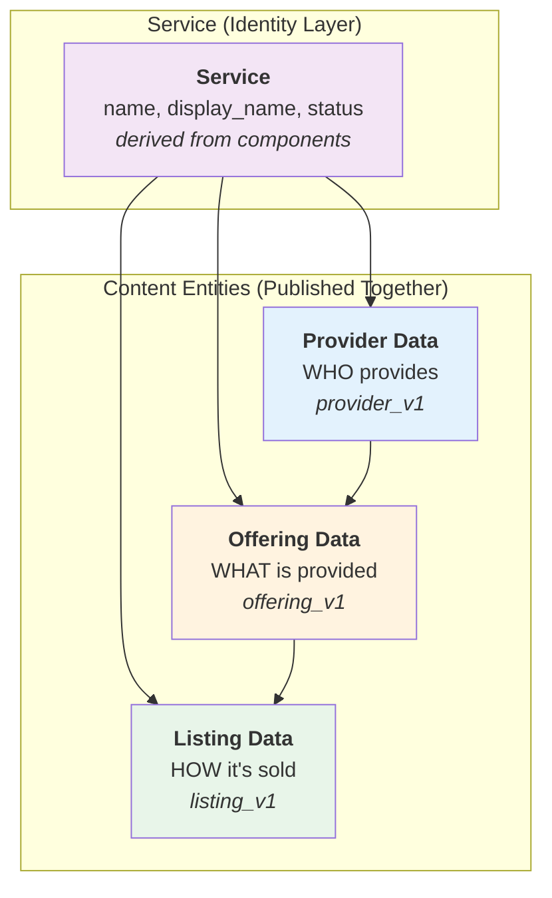
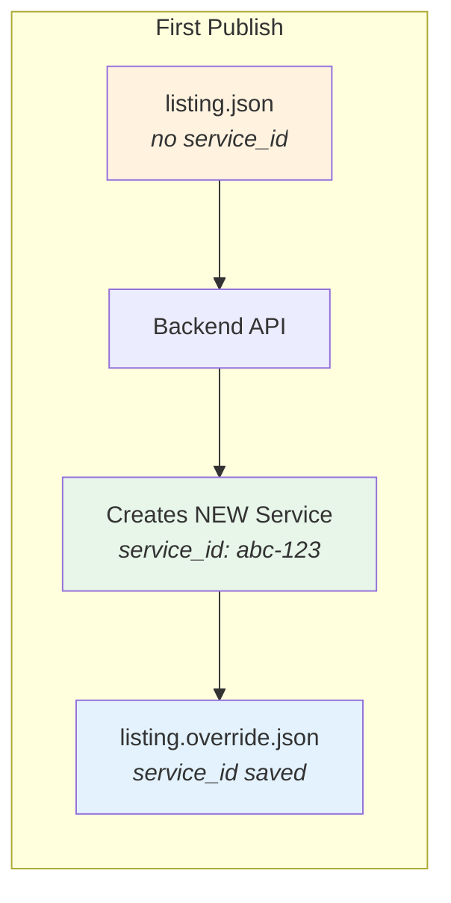
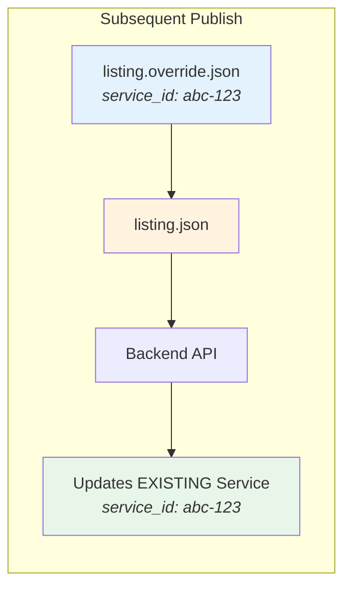

# Data Directory Structure

## Overview

UnitySVC provides two ways to manage service data:

1. **Web Interface** ([unitysvc.com](https://unitysvc.com)) - Create and edit data visually, then export for SDK use
2. **SDK** (this tool) - Manage data locally with version control, automation, and CI/CD integration

The SDK follows a **local-first, version-controlled workflow**. All service data is maintained in a local directory (typically called `data/`) that is version-controlled with git. Data can be created via the web interface and exported, or created manually following the schemas.

## The Service Data Model

A **Service** in UnitySVC is an identity layer that connects a seller to three complementary data components. These are organized separately in the filesystem for reusability, but are **published together** as a unified service:



### Service Identity

When you publish provider, offering, and listing data together, the platform creates a **Service** record that:

-   **Links** the seller to the content (provider, offering, listing)
-   **Derives its name** from `listing.name`, or `offering.name` if listing name is unspecified
-   **Derives its display_name** from `listing.display_name`, `offering.display_name`, `listing.name`, or `offering.name` (first non-empty value)
-   **Derives its status** from the component statuses - a service is considered `draft` if any component is draft

The Service provides a stable identity that subscriptions reference, while the content entities (Provider, Offering, Listing) are immutable and content-addressed.

### Component Details

| Component | Schema | Location | Purpose |
|-----------|--------|----------|---------|
| **Provider Data** | `provider_v1` | `{provider}/provider.json` | Identity of the service provider |
| **Offering Data** | `offering_v1` | `{provider}/services/{service}/offering.json` | Technical service definition |
| **Listing Data** | `listing_v1` | `{provider}/services/{service}/listing-*.json` | Customer-facing presentation |

### Why Three Parts?

1. **Provider Data** - Defined once per provider, automatically shared across all their offerings
2. **Offering Data** - Defined once per service, can have multiple listings (pricing tiers, marketplaces)
3. **Listing Data** - Defines how each service variant is presented and priced for customers

This separation enables:
- **Reusability**: Update provider info once, affects all services
- **Flexibility**: One offering can have basic/premium/enterprise listings
- **Maintainability**: Clear separation of concerns
- **Immutability**: Content entities are content-addressed; same content = same ID

### Publishing Model

When you run `usvc publish`, the SDK uses a **listing-centric** approach:

1. Finds all listing files (`listing_v1` schema) in the directory tree
2. For each listing, locates the **single** offering file (`offering_v1`) in the same directory
3. Locates the provider file (`provider_v1`) in the parent directory
4. Publishes all three together as a unified service to `/seller/services`

**Relationship by Location**: The relationship between providers, offerings, and listings is determined entirely by file location:
- A listing belongs to the offering in the same directory
- An offering belongs to the provider in the parent directory
- No explicit linking fields (like `service_name` or `provider_name`) are needed in the data files

```mermaid
graph TD
    A[Listing File] -->|same directory| B[Offering File]
    A -->|parent directory| C[Provider File]
    A & B & C -->|published together| D[/seller/services API]
```

### Service Publishing Lifecycle

Understanding how services are created and updated is essential for managing your service catalog:

#### First Publish: New Service Creation

When you publish a listing file for the first time (from a new repository or data directory), **a new Service is always created**, even if the content is identical to an existing service. This is because:

- Each listing file represents a distinct service identity
- The Service ID is the stable identifier that subscriptions reference
- Content entities (provider, offering, listing) are content-addressed and may be shared, but the Service itself is unique



#### Service ID Persistence

After a successful first publish, the SDK automatically saves the `service_id` to an override file:

```
listing.json       →  listing.override.json
listing.toml       →  listing.override.toml
listing-premium.json → listing-premium.override.json
```

Example override file content:
```json
{
  "service_id": "550e8400-e29b-41d4-a716-446655440000"
}
```

This override file should be:
- **Committed to version control** - preserves the service identity across team members and CI/CD
- **Never manually edited** (except when intentionally publishing as new)
- **Environment-specific** if deploying to multiple environments (staging, production)

#### Subsequent Publishes: Service Updates

On subsequent publishes, the SDK automatically loads the `service_id` from the override file and includes it in the publish request. This ensures the existing service is **updated** rather than creating a new one:



When updating:
- The Service ID remains stable (subscriptions continue to work)
- Content entities are updated or created as needed
- If content is unchanged, the publish returns "unchanged" status

#### Publishing as New (Ignoring Existing Service)

To publish a service as completely new (ignoring any existing `service_id`), delete the override file before publishing:

```bash
# Remove override file to publish as new service
rm listing.override.json

# Publish - will create a NEW service with a new service_id
usvc publish --data-path ./my-provider/services/my-service/listing.json
```

Common use cases for publishing as new:
- The service was accidentally deleted from the backend
- Deploying to a different environment (staging vs production)
- Creating a variant/copy of an existing service

#### Multiple Environments

For deploying the same service to multiple environments, manage separate override files:

```
listing.json                     # Base listing data
listing.override.json            # Production service_id
listing.staging.override.json    # Staging service_id (gitignored or separate branch)
```

## Required File Structure

The data directory must follow a specific structure with naming conventions and file placement rules:

```
data/
├── ${provider_name}/                    # Provider directory (matches provider name)
│   ├── provider.json or provider.toml   # Required: Provider Data
│   ├── README.md                        # Optional: Provider documentation
│   ├── terms-of-service.md             # Optional: Provider ToS
│   ├── docs/                            # Optional: Shared documentation folder
│   │   ├── code-example.py             # Can be referenced by multiple services
│   │   └── api-guide.md                # Shared across services
│   └── services/                        # Required: Services directory
│       ├── ${service_name}/             # Service directory (matches service name)
│       │   ├── offering.json or offering.toml     # Required: Offering Data
│       │   ├── listing-${variant}.json or .toml  # Required: Listing Data
│       │   └── specific-example.md      # Optional: Service-specific docs
│       └── ${another_service}/
│           ├── offering.json
│           └── listing-premium.json     # Can reference ../../docs/code-example.py
└── ${another_provider}/
    ├── provider.toml
    └── services/
        └── ...
```

## Naming Rules and Restrictions

### 1. Provider Directory (`${provider_name}/`)

-   **Must match** the `name` field in `provider.json`/`provider.toml`
-   Name is normalized: lowercase with hyphens replacing spaces/underscores
-   Example: Provider name `"My Provider"` → directory `my-provider/`

### 2. Services Directory

-   **Must be** named `services/` under each provider directory
-   Path: `${provider_name}/services/`
-   This is where all service offerings and listings are defined

### 3. Service Directory (`${service_name}/`)

-   **Must match** the `name` field in `offering.json`/`offering.toml`
-   Name is normalized: lowercase with hyphens
-   Example: Service name `"GPT-4"` → directory `gpt-4/`
-   Located under: `${provider_name}/services/${service_name}/`

### 4. Offering Files (Offering Data)

-   **offering.json** or **offering.toml**: Service offering metadata (required)
-   Schema must be `"offering_v1"`
-   **Exactly one** offering file per service directory
-   Contains upstream service details, pricing, access interfaces
-   Defines what the provider offers
-   Location: `${provider_name}/services/${service_name}/offering.json`
-   The offering automatically belongs to the provider in the parent directory

### 5. Listing Files (Listing Data)

-   **listing-${variant}.json** or **listing-${variant}.toml**: Service listing (required)
-   File name pattern: `listing-*.json` or `listing-*.toml`
-   Commonly named: `listing-default.json`, `listing-premium.json`, `listing-basic.json`
-   Schema must be `"listing_v1"`
-   Contains user-facing information, downstream pricing, documentation
-   Defines how the seller presents/sells the service
-   Location: `${provider_name}/services/${service_name}/listing-*.json`
-   Automatically belongs to the single offering in the same directory

#### Multiple Listings Per Service

When a single service offering has multiple listings (e.g., different pricing tiers, different marketplaces), the filename becomes significant:

-   **Filename as identifier**: If the `name` field is not provided in the listing file, the filename (without extension) is automatically used as the listing name
-   **Example**: `listing-premium.json`, `listing-basic.json`, `listing-enterprise.json` for different tiers
-   **Best practice**: Use descriptive filenames that indicate the listing variant, or explicitly set the `name` field in each file

### 6. External Files (Documentation, Code Examples, etc.)

-   External files like code examples, documentation, images can be placed anywhere in the directory structure
-   They are referenced by **relative paths** from the referencing file
-   This allows sharing files across multiple services

## File Formats

Both JSON and TOML formats are supported for all data files:

### JSON Format

```json
{
    "schema": "offering_v1",
    "name": "my-service",
    "display_name": "My Service",
    "description": "A high-performance digital service"
}
```

### TOML Format

```toml
schema = "offering_v1"
name = "my-service"
display_name = "My Service"
description = "A high-performance digital service"
```

## Override Files

Override files provide a way to complement and customize data files without modifying the base files. This is particularly useful when base files are auto-generated by scripts, and you need to manually curate specific values like status, logo URLs, or other metadata.

### Naming Pattern

Override files follow the pattern: `<base_name>.override.<extension>`

Examples:

-   `offering.json` → `service.override.json`
-   `provider.toml` → `provider.override.toml`
-   `listing-premium.json` → `listing-premium.override.json`

### How Override Files Work

When any data file is loaded by the SDK:

1. The base file is loaded first
2. The system checks for a corresponding `.override.*` file
3. If found, the override file is loaded and **deep-merged** into the base data
4. Override values take precedence over base values

This merge happens automatically and transparently - you don't need to do anything special.

### Merge Behavior

**Nested Dictionaries**: Recursively merged - override values complement and replace base values

**Example**:

```json
// Base: offering.json
{
  "name": "my-service",
  "config": {
    "host": "localhost",
    "port": 8080,
    "timeout": 30
  }
}

// Override: service.override.json
{
  "config": {
    "port": 9000,
    "ssl": true
  },
  "status": "active"
}

// Merged Result
{
  "name": "my-service",
  "config": {
    "host": "localhost",    // preserved from base
    "port": 9000,           // overridden
    "timeout": 30,          // preserved from base
    "ssl": true             // added from override
  },
  "status": "active"        // added from override
}
```

**Lists and Primitives**: Completely replaced (not merged)

```json
// Base: offering.json
{
  "tags": ["python", "web", "api"],
  "version": 1
}

// Override: service.override.json
{
  "tags": ["backend", "production"]
}

// Merged Result
{
  "tags": ["backend", "production"],  // completely replaced
  "version": 1
}
```

This replacement behavior for lists is intentional and predictable - if you want to change a list, simply specify the complete desired list in the override file.

### Common Use Cases

**1. Manual curation of auto-generated data**

```json
// offering.json (auto-generated by script)
{
  "schema": "offering_v1",
  "name": "gpt-4",
  "description": "Auto-generated description",
  "status": "draft"
}

// service.override.json (manually maintained)
{
  "status": "active",
  "logo_url": "https://example.com/custom-logo.png",
  "featured": true
}
```

**2. Environment-specific configuration**

```toml
# provider.toml (base configuration)
schema = "provider_v1"
name = "my-provider"
base_url = "https://api.example.com"

# provider.override.toml (local testing overrides)
base_url = "http://localhost:8000"
debug_mode = true
```

**3. Maintaining custom metadata**

```json
// listing-premium.json (generated from template)
{
  "schema": "listing_v1",
  "name": "premium-tier",
  "pricing": { /* auto-generated */ }
}

// listing-premium.override.json (manual customization)
{
  "featured": true,
  "promotional_badge": "Best Value",
  "custom_cta": "Try Premium Now!"
}
```

### Version Control

Override files should be committed to version control alongside base files. They are part of your data and represent intentional manual customizations that should be preserved and tracked.

### File Location

Override files must be in the same directory as their corresponding base files, following the directory structure rules described above.

## Schema Requirements

Each file must include a `schema` field identifying its type:

-   **provider.json/toml**: `schema = "provider_v1"`
-   **offering.json/toml**: `schema = "offering_v1"`
-   **listing-\*.json/toml**: `schema = "listing_v1"`

## Validation Rules

The validator enforces these structure rules:

1. **Single offering per directory**: Each service directory must have exactly **one** offering file (`offering_v1` schema)
2. **Listing location**: Each listing file must be in the same directory as a valid offering file
3. **Provider name matching**: Provider directory name must match the normalized `name` field in provider file
4. **Service name matching**: Service directory name must match the normalized `name` field in offering file
5. **Relationship by location**: Listings automatically belong to the offering in their directory—no explicit `service_name` or `provider_name` fields needed

## Shared Documentation Pattern

External files can be shared across multiple services using relative paths:

### Example Structure

```
data/
├── openai/
│   ├── provider.toml
│   ├── docs/
│   │   ├── code-example.py        # Shared by multiple services
│   │   └── api-guide.md
│   └── services/
│       ├── gpt-4/
│       │   ├── offering.json
│       │   └── listing.json       # References: ../../docs/code-example.py
│       └── gpt-3.5-turbo/
│           ├── offering.json
│           └── listing.json       # References: ../../docs/code-example.py (same file!)
```

### In Listing Files

```json
{
    "schema": "listing_v1",
    "user_access_interfaces": {
        "OpenAI API": {
            "access_method": "http",
            "base_url": "${GATEWAY_BASE_URL}/p/openai"
        }
    },
    "documents": {
        "Python Code Example": {
            "file_path": "../../docs/code-example.py",
            "category": "code_example",
            "mime_type": "python"
        }
    }
}
```

**Note:** Both `documents` and `user_access_interfaces` use dict format where the key is the title/name. This enables easy merging via override files.

### Benefits

-   **Reusability**: One code example can be shared by multiple services
-   **Maintainability**: Update one file, all services reflect the change
-   **Organization**: Group related documentation at provider level
-   **Flexibility**: Place files wherever makes sense for your structure

## Complete Example

```
data/
├── openai/                              # Provider: "openai"
│   ├── provider.toml                    # Provider Data: name = "openai"
│   └── services/
│       ├── gpt-4/                       # Service: "gpt-4"
│       │   ├── offering.json             # Offering Data: name = "gpt-4"
│       │   ├── listing-premium.json     # Listing Data (premium tier)
│       │   └── listing-basic.json       # Listing Data (basic tier)
│       └── gpt-3.5-turbo/              # Service: "gpt-3.5-turbo"
│           ├── offering.json             # Offering Data
│           └── listing-default.json     # Listing Data
└── anthropic/                           # Provider: "anthropic"
    ├── provider.json                    # Provider Data: name = "anthropic"
    └── services/
        └── claude-3-opus/               # Service: "claude-3-opus"
            ├── offering.toml            # Offering Data
            ├── listing-standard.toml    # Listing Data (standard tier)
            └── docs/
                └── usage-guide.md
```

When publishing, each listing triggers a unified publish:
- `listing-premium.json` → publishes openai provider + gpt-4 offering + premium listing
- `listing-basic.json` → publishes openai provider + gpt-4 offering + basic listing
- etc.

The provider and offering data are sent with each publish but are deduplicated on the backend (unchanged data returns "unchanged" status).

## Next Steps

-   [File Schemas](file-schemas.md) - Detailed schema specifications
-   [CLI Reference](cli-reference.md#publish) - Publishing command details
-   [Workflows](workflows.md) - Learn about manual and automated workflows
