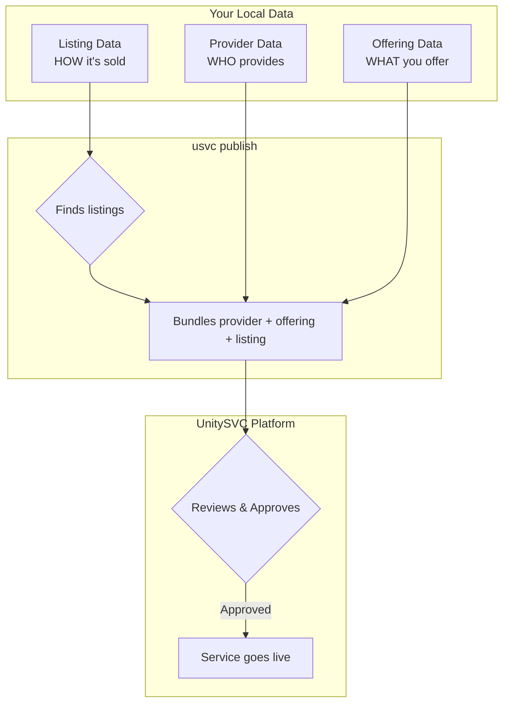

# Getting Started

This guide will help you get started with the UnitySVC Seller SDK.

## Installation

### Requirements

-   Python 3.11 or later
-   pip or uv package manager

### Install from PyPI

```bash
pip install unitysvc-services
```

### Verify Installation

```bash
usvc --help
# Or using the full command name:
unitysvc_services --help
```

You should see the command-line interface help output.

**Note:** The command `unitysvc_services` can be invoked using the shorter alias `usvc`. All examples below use the shorter `usvc` alias.

## Prerequisites: Create Your Seller Account

Before publishing services, you need a seller account on the UnitySVC platform:

1. **Sign up** at [https://unitysvc.com](https://unitysvc.com)
2. **Create your seller account** from the dashboard
3. **Generate a seller API key** - this key contains your seller identity

The seller API key is used for all publishing operations. The platform automatically associates your providers, offerings, and listings with your seller account.

## Understanding the Service Data Model

Before creating your first service, understand how UnitySVC structures service data:

```
┌─────────────────────────────────────────────────────────────────────────────┐
│                              SERVICE DATA                                   │
├─────────────────────┬─────────────────────┬─────────────────────────────────┤
│   Provider Data     │   Offering Data     │         Listing Data            │
│   (provider_v1)     │   (offering_v1)     │         (listing_v1)            │
├─────────────────────┼─────────────────────┼─────────────────────────────────┤
│ WHO provides        │ WHAT is provided    │ HOW it's sold to customers      │
└─────────────────────┴─────────────────────┴─────────────────────────────────┘
```

These three parts are **organized separately** for reusability but **published together** as a unified service:

| Component | Purpose | Reusability |
|-----------|---------|-------------|
| **Provider Data** | Identity, contact info, terms of service | One per provider, shared by all offerings |
| **Offering Data** | Service definition, API endpoints, upstream pricing | One per service, can have multiple listings |
| **Listing Data** | Customer-facing info, documentation, pricing | One per pricing tier or marketplace |

## Quick Start: Create Your First Service

### Step 1: Initialize Your Data Directory

Create a new provider:

```bash
usvc init provider my-provider
```

This creates:

```
data/
└── my-provider/
    ├── provider.toml      # Provider Data
    └── services/
```

### Step 2: Create a Service Offering

```bash
usvc init offering my-first-service
```

This creates:

```
data/
└── my-provider/
    └── services/
        └── my-first-service/
            └── service.toml   # Offering Data
```

### Step 3: Create a Service Listing

```bash
usvc init listing my-first-listing
```

This creates:

```
data/
└── my-provider/
    └── services/
        └── my-first-service/
            ├── service.toml   # Offering Data
            └── listing.toml   # Listing Data
```

### Step 4: Edit Your Files

Open the generated files and fill in your service details:

-   **provider.toml** - Provider information (name, display name, contact)
-   **service.toml** - Service offering details (pricing, API endpoints)
-   **listing.toml** - User-facing service information (documentation, customer pricing)

### Step 5: Validate Your Data

```bash
usvc validate
```

Fix any validation errors reported.

### Step 6: Format Your Files

```bash
usvc format
```

This ensures consistent formatting (2-space JSON indentation, proper line endings, etc.).

### Step 7: Publish to UnitySVC Platform

Set your credentials using your **seller API key**:

```bash
export UNITYSVC_BASE_URL="https://api.unitysvc.com/api/v1"
export UNITYSVC_API_KEY="svcpass_your_seller_api_key"
```

Publish your services:

```bash
# From data directory
cd data
usvc publish

# Or specify path
usvc publish --data-path ./data

# Or publish a single listing file
usvc publish --data-path ./data/my-provider/services/my-service/listing.toml
```

#### How Publishing Works

The `usvc publish` command uses a **listing-centric** approach:

1. Finds all listing files (`listing_v1` schema) in the directory
2. For each listing, locates the offering file in the same directory
3. Locates the provider file in the parent directory
4. Publishes all three together to `/seller/services`



| Data Type | Purpose | Key Fields |
|-----------|---------|------------|
| **Provider Data** | Who provides the service | Provider name, contact info, terms |
| **Offering Data** | What you offer to UnitySVC | API endpoints, upstream pricing |
| **Listing Data** | What you offer to customers | Documentation, customer pricing |

### Step 8: Verify Your Published Data

```bash
# Query with default fields
usvc query providers
usvc query offerings
usvc query listings

# Query with custom fields - show only specific columns
usvc query providers --fields id,name,contact_email
usvc query listings --fields id,service_name,listing_type,status

# Query as JSON for programmatic use
usvc query offerings --format json
```

## Next Steps

-   **[Data Structure](data-structure.md)** - Learn about the Service Data model and file organization
-   **[Workflows](workflows.md)** - Explore manual and automated workflows
-   **[CLI Reference](cli-reference.md)** - Browse all available commands

## Common Operations

### List Local Files

```bash
usvc list providers
usvc list offerings
usvc list listings
```

### Update Local Files

```bash
# Update service status
usvc update offering --name my-service --status ready

# Update listing status
usvc update listing --services my-service --status ready
```

### Automated Service Generation

For providers with large catalogs, set up automated generation:

1. Add `services_populator` configuration to `provider.toml`
2. Create a script to fetch and generate service files
3. Run: `usvc populate`

See [Workflows](workflows.md#automated-workflow) for details.

## Troubleshooting

### Validation Errors

-   Check that directory names match normalized field values
-   Ensure all required fields are present
-   Verify file paths are correct (relative paths)

### Publishing Errors

-   Verify API credentials are set correctly
-   Ensure backend URL is accessible
-   Check that listing files have corresponding offering and provider files
-   Check that you're running from the correct directory or using `--data-path`

### "Provider not found" Errors

This typically means:
-   The provider file is missing or not in the expected location (parent of `services/`)
-   The provider file has `status: draft` (draft providers are skipped)

### Format Issues

-   Run `usvc format --check` to see what would change
-   Use `usvc format` to auto-fix formatting

## Getting Help

-   Check the [CLI Reference](cli-reference.md) for command details
-   Review [Data Structure](data-structure.md) for file organization rules
-   Open an issue on [GitHub](https://github.com/unitysvc/unitysvc-services/issues)
