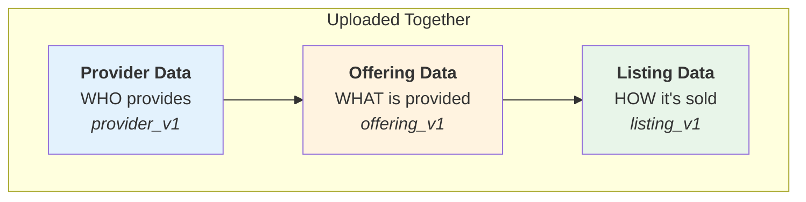
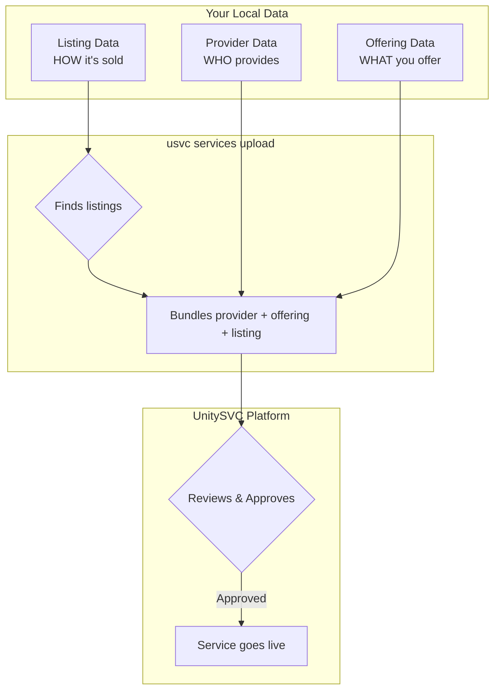

# Getting Started

This guide will help you get started with managing your UnitySVC seller service data.

## Two Ways to Manage Service Data

UnitySVC provides two complementary approaches:

### 1. Web Interface (Recommended for Getting Started)

The [UnitySVC web platform](https://unitysvc.com) provides a user-friendly interface to:

- Create, edit, and manage providers, offerings, and listings
- Validate data with instant feedback
- Preview how services appear to customers
- Export data for use with the SDK

### 2. SDK (This Package)

The SDK enables a **local-first, version-controlled workflow** with key advantages:

- **Version Control** - Track all changes in git, review diffs, roll back mistakes
- **Script-Based Generation** - Programmatically generate services from provider APIs
- **CI/CD Automation** - Automatically upload updates and manage service lifecycle via GitHub Actions
- **Offline Work** - Edit locally, validate without network, upload when ready
- **Code Review** - Use pull requests to review service changes before uploading
- **Service Lifecycle** - Submit services for review, deprecate outdated services, withdraw services from marketplace

**Recommended workflow**: Start with the web interface to create initial data, then use the SDK for ongoing management and automation.

## Installation

### Requirements

- Python 3.11 or later
- pip or uv package manager

### Install from PyPI

```bash
pip install unitysvc-services
```

### Verify Installation

```bash
usvc --help
# Or using the full command name:
unitysvc_services --help
```

You should see the command-line interface help output.

**Note:** The command `unitysvc_services` can be invoked using the shorter alias `usvc`. All examples below use the shorter `usvc` alias.

## Prerequisites: Create Your Seller Account

Before uploading services, you need a seller role on the UnitySVC platform:

1. **Sign up** at [https://unitysvc.com](https://unitysvc.com)
2. **Add a seller role** - go to "Add a role", select "Become a seller", and wait for approval
3. **Generate a seller API key** - this key contains your seller identity

The seller API key is used for all upload and service management operations. The platform automatically associates your providers, offerings, and listings with your seller account.

## Understanding the Service Data Model

Before creating your first service, understand how UnitySVC structures service data:



These three parts are **organized separately** for reusability but **uploaded together** as a unified service:

| Component         | Purpose                                             | Reusability                                 |
| ----------------- | --------------------------------------------------- | ------------------------------------------- |
| **Provider Data** | Identity, contact info, terms of service            | One per provider, shared by all offerings   |
| **Offering Data** | Service definition, API endpoints, upstream pricing | One per service, can have multiple listings |
| **Listing Data**  | Customer-facing info, documentation, pricing        | One per pricing tier or marketplace         |

## Quick Start: Your First Service

### Step 1: Create Data via Web Interface

1. Go to [unitysvc.com](https://unitysvc.com) and sign in
2. Create your **Provider** (your company/organization info)
3. Create an **Offering** (the service you're providing)
4. Create a **Listing** (how customers see and purchase your service)
5. **Export** your data as JSON/TOML files

### Step 2: Set Up Your Local Directory

Place the exported files in the expected directory structure:

```
data/
└── my-provider/
    ├── provider.json          # Provider Data
    └── services/
        └── my-service/
            ├── offering.json  # Offering Data
            └── listing.json   # Listing Data
```

**Alternative**: You can also create files manually following the [File Schemas](file-schemas.md) documentation.

### Step 3: Validate Your Data

```bash
usvc data validate
```

Fix any validation errors reported.

### Step 4: Format Your Files (Optional)

```bash
usvc data format
```

This step is optional and not required for upload. It ensures consistent formatting (2-space JSON indentation, sorted keys, proper line endings, etc.), which helps keep data in a consistent format and makes version control diffs easier to read.

### Step 5: Upload to UnitySVC Platform

Set your credentials using your **seller API key**:

```bash
export UNITYSVC_BASE_URL="https://api.unitysvc.com/v1"
export UNITYSVC_API_KEY="svcpass_your_seller_api_key"
```

Upload your services:

```bash
# From data directory
cd data
usvc services upload

# Or specify path
usvc services upload --data-path ./data

# Or upload a single listing file
usvc services upload --data-path ./data/my-provider/services/my-service/listing.toml
```

#### How Uploading Works

The `usvc services upload` command uses a **listing-centric** approach:

1. Finds all listing files (`listing_v1` schema) in the directory
2. For each listing, locates the offering file in the same directory
3. Locates the provider file in the parent directory
4. Uploads all three together to `/seller/services`



| Data Type         | Purpose                     | Key Fields                         |
| ----------------- | --------------------------- | ---------------------------------- |
| **Provider Data** | Who provides the service    | Provider name, contact info, terms |
| **Offering Data** | What you offer to UnitySVC  | API endpoints, upstream pricing    |
| **Listing Data**  | What you offer to customers | Documentation, customer pricing    |

### Step 6: Verify Your Uploaded Data

```bash
# List your services on the backend
usvc services list

# List with custom fields - show only specific columns
usvc services list --fields id,name,status

# Filter by status
usvc services list --status active

# List as JSON for programmatic use
usvc services list --format json

# Show details of a specific service
usvc services show <service-id>
```

## Next Steps

- **[Data Structure](data-structure.md)** - Learn about the Service Data model and file organization
- **[Workflows](workflows.md)** - Explore manual and automated workflows
- **[CLI Reference](cli-reference.md)** - Browse all available commands

## Common Operations

### List Local Data Files

```bash
usvc data list services
usvc data list providers
usvc data list offerings
usvc data list listings
```

### Show Local Data Details

```bash
usvc data show provider <name>
usvc data show offering <name>
usvc data show listing <name>
usvc data show service <name>
```

### Manage Service Lifecycle (Remote)

```bash
# Submit draft services for review
usvc services submit <service-id>

# Deprecate active services
usvc services deprecate <service-id>

# Withdraw pending services back to draft
usvc services withdraw <service-id>

# Delete services
usvc services delete <service-id>
```

### Automated Service Generation

For providers with large catalogs, set up automated generation:

1. Add `services_populator` configuration to `provider.toml`
2. Create a script to fetch and generate service files
3. Run: `usvc data populate`

See [Workflows](workflows.md#automated-workflow) for details.

## Troubleshooting

### Validation Errors

- Check that directory names match normalized field values
- Ensure all required fields are present
- Verify file paths are correct (relative paths)

### Upload Errors

- Verify API credentials are set correctly
- Ensure backend URL is accessible
- Check that listing files have corresponding offering and provider files
- Check that you're running from the correct directory or using `--data-path`

### "Provider not found" Errors

This typically means:

- The provider file is missing or not in the expected location (parent of `services/`)
- The provider file has `status: draft` (draft providers are skipped)

### Format Issues

- Run `usvc data format --check` to see what would change
- Use `usvc data format` to auto-fix formatting

## Getting Help

- Check the [CLI Reference](cli-reference.md) for command details
- Review [Data Structure](data-structure.md) for file organization rules
- Open an issue on [GitHub](https://github.com/unitysvc/unitysvc-services/issues)
