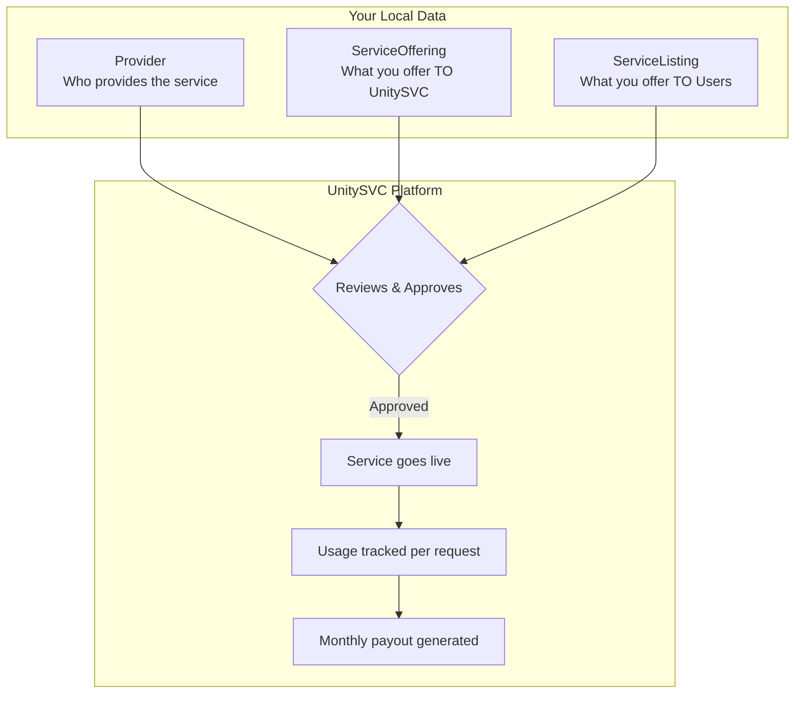

# Getting Started

This guide will help you get started with the UnitySVC Seller SDK.

## Installation

### Requirements

-   Python 3.11 or later
-   pip or uv package manager

### Install from PyPI

```bash
pip install unitysvc-services
```

### Verify Installation

```bash
usvc --help
# Or using the full command name:
unitysvc_services --help
```

You should see the command-line interface help output.

**Note:** The command `unitysvc_services` can be invoked using the shorter alias `usvc`. All examples below use the shorter `usvc` alias.

## Prerequisites: Create Your Seller Account

Before publishing services, you need a seller account on the UnitySVC platform:

1. **Sign up** at [https://unitysvc.com](https://unitysvc.com)
2. **Create your seller account** from the dashboard
3. **Generate a seller API key** - this key contains your seller identity

The seller API key is used for all publishing operations. The platform automatically associates your providers, offerings, and listings with your seller account.

## Quick Start: Create Your First Service

### Step 1: Initialize Your Data Directory

Create a new provider:

```bash
usvc init provider my-provider
```

This creates:

```
data/
└── my-provider/
    ├── provider.toml
    └── services/
```

### Step 2: Create a Service Offering

```bash
usvc init offering my-first-service
```

This creates:

```
data/
└── my-provider/
    └── services/
        └── my-first-service/
            └── service.toml
```

### Step 3: Create a Service Listing

```bash
usvc init listing my-first-listing
```

This creates:

```
data/
└── my-provider/
    └── services/
        └── my-first-service/
            ├── service.toml
            └── listing.toml
```

### Step 4: Edit Your Files

Open the generated files and fill in your service details:

-   **provider.toml** - Provider information (name, display name, contact)
-   **service.toml** - Service offering details (pricing, API endpoints)
-   **listing.toml** - User-facing service information

### Step 5: Validate Your Data

```bash
usvc validate
```

Fix any validation errors reported.

### Step 6: Format Your Files

```bash
usvc format
```

This ensures consistent formatting (2-space JSON indentation, proper line endings, etc.).

### Step 7: Publish to UnitySVC Platform

Set your credentials using your **seller API key**:

```bash
export UNITYSVC_BASE_URL="https://api.unitysvc.com/api/v1"
export UNITYSVC_API_KEY="svcpass_your_seller_api_key"
```

Publish your data (publishes all types in correct order: providers → offerings → listings):

```bash
# From data directory
cd data
usvc publish

# Or specify path
usvc publish --data-path ./data

# Or publish specific types
usvc publish providers
usvc publish offerings
usvc publish listings
```

#### What Gets Published?

When you run `usvc publish`, you're submitting your service data to UnitySVC:



| Data Type           | Purpose                    | Key Fields                                        |
| ------------------- | -------------------------- | ------------------------------------------------- |
| **Provider**        | Who provides the service   | Provider name, contact info                       |
| **ServiceOffering** | What you offer TO UnitySVC | API endpoints, seller pricing                     |
| **ServiceListing**  | What you offer TO Users    | User-facing info, customer pricing, documentation |

After UnitySVC reviews and approves your submission:

1. **Service goes live** - Available to customers on the platform
2. **Usage tracked** - Every API request is metered and logged
3. **Monthly payouts** - You receive payouts based on usage × seller price

See [Seller Lifecycle](seller-lifecycle.md) for details on invoicing, disputes, and payouts.

### Step 9: Verify Your Published Data

```bash
# Query with default fields
usvc query providers
usvc query offerings
usvc query listings

# Query with custom fields - show only specific columns
usvc query providers --fields id,name,contact_email
usvc query listings --fields id,service_name,listing_type,status

# Query as JSON for programmatic use
usvc query offerings --format json
```

## Next Steps

-   **[Data Structure](data-structure.md)** - Learn about file organization and naming rules
-   **[Workflows](workflows.md)** - Explore manual and automated workflows
-   **[CLI Reference](cli-reference.md)** - Browse all available commands

## Common Operations

### List Local Files

```bash
usvc list providers
usvc list offerings
usvc list listings
```

Note: Sellers are managed on the UnitySVC platform, not in local files.

### Update Local Files

```bash
# Update service status
usvc update offering --name my-service --status ready

# Update listing status
usvc update listing --services my-service --status in_service
```

### Automated Service Generation

For providers with large catalogs, set up automated generation:

1. Add `services_populator` configuration to `provider.toml`
2. Create a script to fetch and generate service files
3. Run: `usvc populate`

See [Workflows](workflows.md#automated-workflow) for details.

## Troubleshooting

### Validation Errors

-   Check that directory names match normalized field values
-   Ensure all required fields are present
-   Verify file paths are correct (relative paths)

### Publishing Errors

-   Verify API credentials are set correctly
-   Use `usvc publish` (without subcommand) to publish all types in the correct order automatically
-   Ensure backend URL is accessible
-   Check that you're running from the correct directory or using `--data-path`

### Format Issues

-   Run `usvc format --check` to see what would change
-   Use `usvc format` to auto-fix formatting

## Getting Help

-   Check the [CLI Reference](cli-reference.md) for command details
-   Review [Data Structure](data-structure.md) for file organization rules
-   Open an issue on [GitHub](https://github.com/unitysvc/unitysvc-services/issues)
