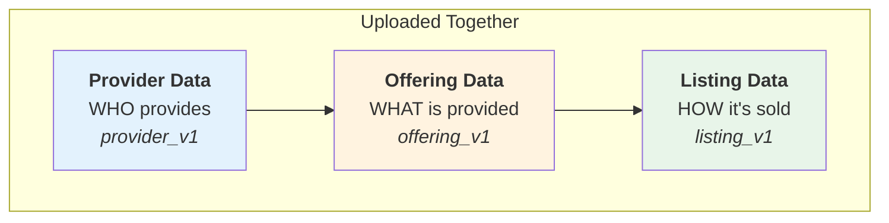
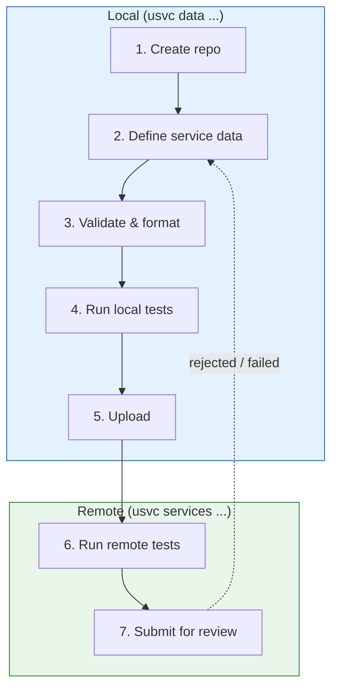

# Getting Started

This guide will help you get started with managing your UnitySVC seller service data.

## Two Ways to Manage Service Data

UnitySVC provides two complementary approaches:

### 1. Web Interface (Recommended for Getting Started)

The [UnitySVC web platform](https://unitysvc.com) provides a user-friendly interface to:

- Create, edit, and manage providers, offerings, and listings
- Validate data with instant feedback
- Preview how services appear to customers
- Export data for use with the SDK

### 2. SDK (This Package)

The SDK enables a **local-first, version-controlled workflow** with key advantages:

- **Version Control** - Track all changes in git, review diffs, roll back mistakes
- **Script-Based Generation** - Programmatically generate services from provider APIs
- **CI/CD Automation** - Automatically upload updates and manage service lifecycle via GitHub Actions
- **Offline Work** - Edit locally, validate without network, upload when ready
- **Code Review** - Use pull requests to review service changes before uploading
- **Service Lifecycle** - Submit services for review, deprecate outdated services, withdraw services from marketplace

**Recommended workflow**: Start with the web interface to create initial data, then use the SDK for ongoing management and automation.

## Installation

### Requirements

- Python 3.11 or later
- pip or uv package manager

### Install from PyPI

```bash
pip install unitysvc-services
```

### Verify Installation

```bash
usvc --help
# Or using the full command name:
unitysvc_services --help
```

You should see the command-line interface help output.

**Note:** The command `unitysvc_services` can be invoked using the shorter alias `usvc`. All examples below use the shorter `usvc` alias.

## Prerequisites: Create Your Seller Account

Before uploading services, you need a seller role on the UnitySVC platform:

1. **Sign up** at [https://unitysvc.com](https://unitysvc.com)
2. **Add a seller role** - go to "Add a role", select "Become a seller", and wait for approval
3. **Generate a seller API key** - this key contains your seller identity

The seller API key is used for all upload and service management operations. The platform automatically associates your providers, offerings, and listings with your seller account.

## Understanding the Service Data Model

Before creating your first service, understand how UnitySVC structures service data:


```mermaid
flowchart TB
    subgraph Service["Uploaded Together"]
        P["<b>Provider Data</b><br/>WHO provides<br/><i>provider_v1</i>"]
        O["<b>Offering Data</b><br/>WHAT is provided<br/><i>offering_v1</i>"]
        L["<b>Listing Data</b><br/>HOW it's sold<br/><i>listing_v1</i>"]
    end

    P --> O --> L

    style P fill:#e3f2fd
    style O fill:#fff3e0
    style L fill:#e8f5e9
```

These three parts are **organized separately** for reusability but **uploaded together** as a unified service:

| Component         | Purpose                                             | Reusability                                 |
| ----------------- | --------------------------------------------------- | ------------------------------------------- |
| **Provider Data** | Identity, contact info, terms of service            | One per provider, shared by all offerings   |
| **Offering Data** | Service definition, API endpoints, upstream pricing | One per service, can have multiple listings |
| **Listing Data**  | Customer-facing info, documentation, pricing        | One per pricing tier or marketplace         |

## Quick Start: Your First Service


```mermaid
flowchart TD
    subgraph local["Local (usvc data ...)"]
        S1["1. Create repo"]
        S2["2. Define service data"]
        S3["3. Validate & format"]
        S4["4. Run local tests"]
        S5["5. Upload"]
        S1 --> S2 --> S3 --> S4 --> S5
    end

    S5 --> S6

    subgraph remote["Remote (usvc services ...)"]
        S6["6. Run remote tests"]
        S7["7. Submit for review"]
        S6 --> S7
    end

    S7 -. "rejected / failed" .-> S2

    style local fill:#e3f2fd,stroke:#1565c0
    style remote fill:#e8f5e9,stroke:#2e7d32
```

### Step 1: Create a Local Repository

Create a new repository from the [unitysvc-services-template](https://github.com/unitysvc/unitysvc-services-template), which provides the directory structure, CI/CD workflows, and example files. Alternatively, fork any of the publicly available service repositories under the [unitysvc GitHub organization](https://github.com/unitysvc) (e.g., `unitysvc-services-openai`, `unitysvc-services-groq`) and adapt them to your provider.

Your repository should follow this structure:

```
data/
└── my-provider/
    ├── provider.toml          # Provider Data
    └── services/
        └── my-service/
            ├── offering.toml  # Offering Data
            └── listing.toml   # Listing Data
```

### Step 2: Define Your Service Data

There are several ways to create and edit your provider, offering, and listing files:

1. **Manually** — follow the [File Schemas](file-schemas.md) reference and existing examples in the template or forked repository
2. **Web interface** — use the [UnitySVC web platform](https://unitysvc.com) to fill in forms for your provider, offering, and listing, then export as JSON/TOML files
3. **AI-assisted** — ask Claude Code or another AI assistant to familiarize itself with the [unitysvc-services documentation](https://unitysvc-services.readthedocs.io) (or even the SDK source code), then have it prepare the data files for you

### Step 3: Validate and Format

```bash
# Validate your data against schemas
usvc data validate

# Optional: auto-format for consistent style (helps with cleaner git diffs)
usvc data format
```

Fix any validation errors before proceeding.

### Step 4: Run Local Tests (Required)

```bash
usvc data run-tests
```

Local tests run your code examples and connectivity checks against real upstream endpoints. Provide any required secrets as environment variables:

```bash
# For managed services
export PROVIDER_API_KEY="sk-..."
usvc data run-tests

# For BYOK services
export GROQ_API_KEY="gsk_..."
usvc data run-tests data/groq/services/llama-3.3-70b-versatile-byok
```

All tests must pass before uploading.

### Step 5: Upload to UnitySVC Platform

Set your credentials using your **seller API key**:

```bash
export UNITYSVC_API_URL="https://api.unitysvc.com/v1"
export UNITYSVC_SELLER_API_KEY="svcpass_your_seller_api_key"
```

Upload your services:

```bash
usvc data upload

# Or specify path
usvc data upload --data-path ./data

# Or upload a single listing
usvc data upload --data-path ./data/my-provider/services/my-service/listing.toml
```

### Step 6: Run Remote Tests (Required)

```bash
usvc services run-tests <service-id>
```

Remote tests run against the live platform, verifying that the service works end-to-end through the gateway. Tests must pass (or be explicitly skipped) before submission.

### Step 7: Submit for Review

```bash
usvc services submit <service-id>
```

This submits your service for platform review. Once approved, the service goes live on the marketplace.

!!! tip "Iterate until approved"
    If any step fails or the submission is rejected, fix the issues and repeat from the relevant step. The typical cycle is: edit → validate → test locally → upload → test remotely → submit.

## Next Steps

- **[Data Structure](data-structure.md)** - Learn about the Service Data model and file organization
- **[Workflows](workflows.md)** - Explore manual and automated workflows
- **[CLI Reference](cli-reference.md)** - Browse all available commands

## Troubleshooting

### Validation Errors

- Check that directory names match normalized field values
- Ensure all required fields are present
- Verify file paths are correct (relative paths)

### Upload Errors

- Verify API credentials are set correctly
- Ensure backend URL is accessible
- Check that listing files have corresponding offering and provider files
- Check that you're running from the correct directory or using `--data-path`

### "Provider not found" Errors

This typically means:

- The provider file is missing or not in the expected location (parent of `services/`)
- The provider file has `status: draft` (draft providers are skipped)

### Format Issues

- Run `usvc data format --check` to see what would change
- Use `usvc data format` to auto-fix formatting

## Getting Help

- Check the [CLI Reference](cli-reference.md) for command details
- Review [Data Structure](data-structure.md) for file organization rules
- Open an issue on [GitHub](https://github.com/unitysvc/unitysvc-services/issues)
