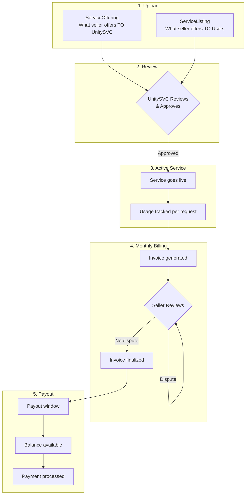
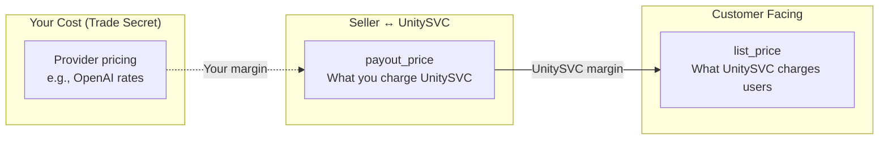
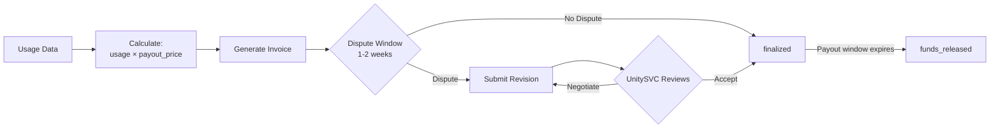
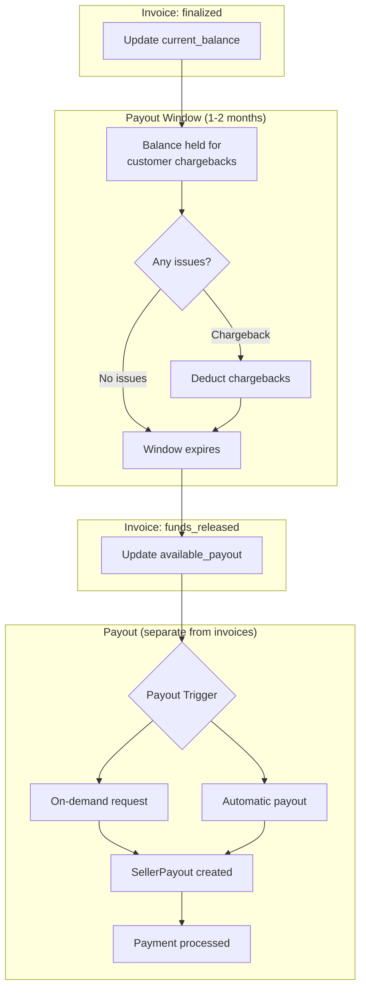

# Seller Lifecycle

This guide explains what happens after you upload your services to UnitySVC - from approval through invoicing and payouts.

## Overview

## 1. Upload & Approval

When you run `usvc services upload`, you submit:

| Data Type           | Purpose                    | Key Fields                                    |
| ------------------- | -------------------------- | --------------------------------------------- |
| **ServiceOffering** | What you offer TO UnitySVC | Provider info, API access, `payout_price`     |
| **ServiceListing**  | What you offer TO Users    | User-facing info, `list_price`, documentation |

**Pricing Model:**

-   **payout_price** is the agreed rate between you and UnitySVC
-   Your actual provider costs are your trade secret - UnitySVC doesn't need to know
-   **list_price** is what end users pay

## 2. Active Service

Once approved, your service goes live:

-   **Listed on marketplace** - Users can discover and subscribe
-   **API routing configured** - Requests flow through UnitySVC gateway
-   **Usage metering** - Every request is tracked in real-time

## 3. Monthly Invoicing

At the end of each month, UnitySVC generates your invoice:

### Invoice Contents

Your monthly invoice includes:

| Field               | Description                                |
| ------------------- | ------------------------------------------ |
| **Billing Period**  | Start and end dates (e.g., Jan 1 - Jan 31) |
| **Opening Balance** | Carried forward from previous invoice      |
| **Seller Payout**   | Sum of (usage × payout_price) per service  |
| **Adjustments**     | Any credits or debits applied              |
| **Closing Balance** | Total owed to you                          |

### Line Items

Each service shows:

-   Request count
-   Token usage (input/output)
-   Seller price applied
-   Calculated payout

### Dispute Window

You have **1-2 weeks** to review the invoice:

-   **No action needed** if the invoice is correct - it auto-finalizes
-   **Dispute** if you see issues - submit a revised invoice with justification

**Valid dispute reasons:**

| Reason        | Example                             |
| ------------- | ----------------------------------- |
| Rate change   | "We agreed to lower rate mid-month" |
| Service issue | "Service was down for 2 days"       |
| Billing error | "Usage count looks incorrect"       |

## 4. Payout Process

Invoices track earnings. Actual payouts are handled separately - you can request payouts from your available balance at any time.

### Invoice Statuses

| Status           | Description                           | Balance Updated    |
| ---------------- | ------------------------------------- | ------------------ |
| `generated`      | Invoice created, in dispute window    | -                  |
| `disputed`       | You disputed, awaiting review         | -                  |
| `resolved`       | Dispute resolved                      | -                  |
| `finalized`      | Invoice closed                        | `current_balance`  |
| `funds_released` | Payout window expired                 | `available_payout` |
| `voided`         | Invoice voided (fraud/abuse detected) | -                  |

### Balance Fields

Your seller account tracks two balances:

| Field                | Description                                          |
| -------------------- | ---------------------------------------------------- |
| **current_balance**  | Total earnings (closing balance from latest invoice) |
| **available_payout** | Amount available for immediate payout                |

### Payout Window

The payout window (default 2 months) provides time for:

-   Customer dispute resolution
-   Chargeback handling
-   Fraud detection

**Trusted sellers** may receive a shorter payout window as an incentive.

### Payout Modes

| Mode                      | Description                                |
| ------------------------- | ------------------------------------------ |
| **On-demand**             | You request payout of available balance    |
| **Automatic (threshold)** | Payout when balance exceeds your threshold |
| **Automatic (scheduled)** | Payout on your configured schedule         |

### Timeline Example

| Date   | Event                                     | current_balance | available_payout |
| ------ | ----------------------------------------- | --------------- | ---------------- |
| Feb 1  | January invoice generated ($1,000)        | -               | -                |
| Feb 14 | Dispute deadline passes                   | -               | -                |
| Feb 15 | Invoice finalized                         | $1,000          | $0               |
| Mar 15 | February invoice finalized ($1,200)       | $2,200          | $0               |
| Apr 1  | January payout window expires (2 months)  | $2,200          | $1,000           |
| Apr 20 | You request $500 payout                   | $1,700          | $500             |
| May 1  | February payout window expires (2 months) | $1,700          | $1,700           |

## Summary

1. **Publish** your ServiceOffering and ServiceListing
2. **UnitySVC reviews** and approves your submission
3. **Service goes live** and usage is tracked
4. **Monthly invoice** generated based on usage × payout_price
5. **Dispute window** gives you time to review (1-2 weeks)
6. **Payout window** protects against chargebacks (1-2 months)
7. **Payout** when balance becomes available

## Questions?

-   Contact your UnitySVC account manager for billing questions
-   Open an issue on [GitHub](https://github.com/unitysvc/unitysvc-services/issues) for SDK questions
