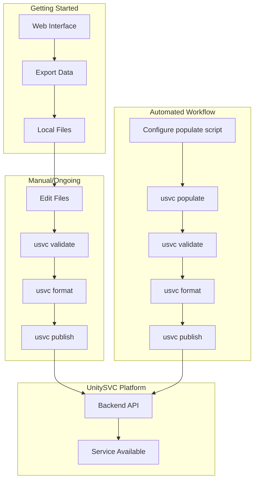
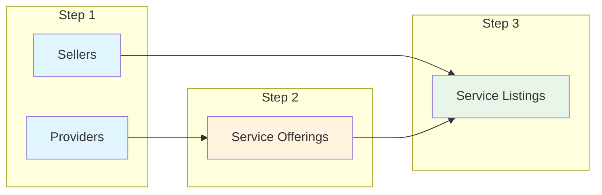

# Workflows

This guide explains the different workflows for managing service data with the UnitySVC Seller SDK.

**Note:** All examples use the shorter `usvc` command alias. You can replace `usvc` with `unitysvc_services` if preferred.

## Overview

UnitySVC provides two ways to create and manage service data:

1. **Web Interface** ([unitysvc.com](https://unitysvc.com)) - Create and edit data visually
2. **SDK** (this tool) - Manage data locally with version control and automation

The SDK supports these workflows:

1. **Web-to-SDK Workflow** - Start with web interface, export to SDK for version control
2. **Manual Workflow** - Create/edit files locally for small catalogs
3. **Automated Workflow** - Script-based generation for large or dynamic catalogs



## Web-to-SDK Workflow

**Recommended for getting started.** Use the web interface for initial setup, then transition to SDK for version control.

### Step-by-Step Process

#### 1. Create Data via Web Interface

1. Go to [unitysvc.com](https://unitysvc.com) and sign in
2. Create your Provider, Offerings, and Listings using the visual editor
3. Export your data as JSON/TOML files

#### 2. Set Up Local Directory

Place exported files in the expected structure:

```
data/
└── my-provider/
    ├── provider.json
    └── services/
        └── my-service/
            ├── offering.json
            └── listing.json
```

#### 3. Validate and Publish

```bash
usvc validate
usvc format
usvc publish
```

#### 4. Ongoing Management

After initial setup, manage changes locally:

-   Edit files directly
-   Use `usvc validate` to check changes
-   Commit to git for version control
-   Use CI/CD for automated publishing

## Manual Workflow

Best for:

-   Small number of services (< 20)
-   Teams comfortable editing JSON/TOML directly
-   Situations where web interface isn't preferred

### Step-by-Step Process

#### 1. Create Files Manually

Create files following the [File Schemas](file-schemas.md) documentation:

```
data/
└── my-provider/
    ├── provider.json          # See provider_v1 schema
    └── services/
        └── my-service/
            ├── offering.json  # See offering_v1 schema
            └── listing.json   # See listing_v1 schema
```

#### 2. Edit Your Files

Fill in your service details:

-   Provider information (name, contact, metadata)
-   Service offering details (API endpoints, pricing, capabilities)
-   Service listing details (user-facing info, documentation)

#### 3. Validate Data

```bash
usvc validate
```

Fix any validation errors. Common issues:

-   Directory names not matching field values
-   Missing required fields
-   Invalid file paths

#### 4. Format Files

```bash
usvc format
```

This ensures:

-   JSON files have 2-space indentation
-   Files end with single newline
-   No trailing whitespace

#### 5. Update Local Files as Needed

```bash
# Update service status
usvc update offering --name my-service --status ready

# Update multiple fields
usvc update offering --name my-service \
  --status ready \
  --display-name "My Updated Service"

# Update listing status
usvc update listing --services my-service --status in_service
```

#### 6. Publish to Platform

```bash
# Set credentials
export UNITYSVC_BASE_URL="https://api.unitysvc.com/api/v1"
export UNITYSVC_API_KEY="your-api-key"

# Publish all (handles order automatically: sellers → providers → offerings → listings)
cd data
usvc publish

# Or from parent directory
usvc publish --data-path ./data
```

#### 7. Verify on Platform

```bash
# Query your services
usvc query

# Or query with custom fields for focused output
usvc query --fields id,name,status

# Filter by status
usvc query --status active
```

### Version Control Integration

```bash
# After creating/updating files
git add data/
git commit -m "Add new service: my-service"
git push

# Publish from CI/CD
usvc validate
usvc publish --data-path ./data
```

## Automated Workflow

Best for providers with:

-   Large service catalogs (> 20 services)
-   Frequently changing services
-   Dynamic pricing or availability
-   Services added/deprecated automatically

### How It Works

1. Configure a populate script in your provider file
2. Script fetches service data from provider's API
3. Script generates service files automatically
4. Validate, format, and publish as normal

### Step-by-Step Process

#### 1. Create Provider with Populate Configuration

Create `data/my-provider/provider.toml` (via web interface export or manually):

```toml
name = "my-provider"
display_name = "My Service Provider"

[services_populator]
command = "populate_services.py"

[services_populator.envs]
API_KEY = "your-provider-api-key"
BASE_URL = "https://api.provider.com/v1"
REGION = "us-east-1"
```

#### 2. Create Populate Script

Create `data/my-provider/populate_services.py`:

```python
#!/usr/bin/env python3
"""Generate service files from provider API."""

import os
import json
from pathlib import Path
import requests

# Get environment variables from services_populator.envs
api_key = os.getenv("API_KEY")
base_url = os.getenv("BASE_URL")
region = os.getenv("REGION")

def fetch_services():
    """Fetch services from provider API."""
    response = requests.get(
        f"{base_url}/services",
        headers={"Authorization": f"Bearer {api_key}"},
        params={"region": region}
    )
    response.raise_for_status()
    return response.json()["services"]

def create_service_files(service_data):
    """Create offering.json and listing.json files."""
    service_name = service_data["name"].lower().replace(" ", "-")
    service_dir = Path(f"services/{service_name}")
    service_dir.mkdir(parents=True, exist_ok=True)

    # Create offering.json
    offering = {
        "schema": "offering_v1",
        "name": service_name,
        "display_name": service_data["display_name"],
        "description": service_data["description"],
        "service_type": "llm",
        "status": "ready",
        # ... map other fields
    }

    with open(service_dir / "offering.json", "w") as f:
        json.dump(offering, f, indent=2, sort_keys=True)
        f.write("\n")

    # Create listing.json
    # Note: No service_name or provider_name needed - relationships determined by file location
    listing = {
        "schema": "listing_v1",
        "status": "ready",
        # ... map other fields
    }

    with open(service_dir / f"listing-svcreseller.json", "w") as f:
        json.dump(listing, f, indent=2, sort_keys=True)
        f.write("\n")

    print(f"Created service: {service_name}")

if __name__ == "__main__":
    services = fetch_services()
    for service_data in services:
        create_service_files(service_data)
    print(f"Generated {len(services)} services")
```

#### 3. Run Populate Command

```bash
# Generate all services
usvc populate

# Generate for specific provider only
usvc populate --provider my-provider

# Dry run to see what would execute
usvc populate --dry-run
```

#### 4. Validate and Format

```bash
usvc validate
usvc format
```

#### 5. Review Changes

```bash
git diff
git add data/
git commit -m "Update service catalog from API"
```

#### 6. Publish

```bash
cd data
usvc publish
```

#### 7. Verify

```bash
# Query your services
usvc query

# Or query with custom fields
usvc query --fields id,name,status
```

### Automation with CI/CD

Create `.github/workflows/update-services.yml`:

```yaml
name: Update Services

on:
    schedule:
        - cron: "0 0 * * *" # Daily at midnight
    workflow_dispatch:

jobs:
    update:
        runs-on: ubuntu-latest
        steps:
            - uses: actions/checkout@v3

            - name: Set up Python
              uses: actions/setup-python@v4
              with:
                  python-: "3.11"

            - name: Install dependencies
              run: pip install unitysvc-services requests

            - name: Generate services
              run: usvc populate

            - name: Validate
              run: usvc validate

            - name: Format
              run: usvc format

            - name: Commit changes
              run: |
                  git config user.name "GitHub Actions"
                  git config user.email "actions@github.com"
                  git add data/
                  git diff --staged --quiet || git commit -m "Update services from API"
                  git push

            - name: Publish to UnitySVC
              env:
                  UNITYSVC_BASE_URL: ${{ secrets.UNITYSVC_BASE_URL }}
                  UNITYSVC_API_KEY: ${{ secrets.UNITYSVC_API_KEY }}
              run: |
                  usvc publish --data-path ./data
```

## Hybrid Workflow

Combine web interface and automated approaches:

1. Use automated populate for most services
2. Use web interface or manual files for special/custom services
3. Use update commands to adjust individual services

```bash
# Generate bulk of services from provider API
usvc populate

# Create premium service via web interface and export, or create files manually
# Place in: data/my-provider/services/premium-service/

# Update specific service
usvc update offering --name premium-service --status ready
```

## Service Publishing Lifecycle

Understanding how services are created and updated is essential for managing your catalog:

### First Publish: New Service Creation

When you publish a listing file for the **first time** (from a new repository or data directory):

1. **A new Service is always created** - even if the content is identical to an existing service
2. The Service ID is generated by the backend
3. **The SDK saves the `service_id`** to an override file (e.g., `listing.override.json`)

```bash
# First publish - creates a new service
$ usvc publish
  + Created service: my-service (provider: my-provider)
    Service ID: 550e8400-e29b-41d4-a716-446655440000
    → Saved to listing.override.json
```

### Override File Persistence

After the first successful publish, the override file contains the stable service identity:

```json
// listing.override.json (auto-generated)
{
  "service_id": "550e8400-e29b-41d4-a716-446655440000"
}
```

**Best practices for override files:**
- **Commit to version control** - preserves service identity across team members
- **Don't manually edit** - the SDK manages this file
- **Keep per-environment** if deploying to staging/production separately

### Subsequent Publishes: Service Updates

On subsequent publishes, the SDK automatically loads the `service_id` from the override file:

```bash
# Subsequent publish - updates existing service
$ usvc publish
  ~ Updated service: my-service (provider: my-provider)
    Service ID: 550e8400-e29b-41d4-a716-446655440000
```

The Service ID remains stable, ensuring:
- Subscriptions continue to work
- Usage history is preserved
- Customers experience no disruption

### Publishing as New Service

To create a completely new service (ignoring existing `service_id`):

```bash
# Delete the override file
rm listing.override.json

# Publish creates a new service with a new ID
usvc publish
```

## Publishing Order

**Recommended:** Use `usvc publish` without subcommands to publish all types automatically in the correct order:



1. **Sellers** - Must exist before listings
2. **Providers** - Must exist before offerings
3. **Service Offerings** - Links providers to services
4. **Service Listings** - Links sellers to offerings

The CLI handles this order automatically when you use `publish` without a subcommand. You can also publish specific types individually if needed (e.g., `usvc publish providers`).

Incorrect order will result in foreign key errors.

## Unpublishing Workflow

The unpublish command allows you to remove data from the UnitySVC backend with full control over cascade behavior.

### Understanding Cascade Deletions

**⚠️ CRITICAL:** Unpublish operations cascade automatically to maintain referential integrity:

-   **Deleting a seller** → Removes ALL listings from that seller (across all providers/offerings)
-   **Deleting a provider** → Removes ALL offerings AND all listings from that provider
-   **Deleting an offering** → Removes ALL listings for that offering
-   **Deleting a listing** → Only removes that specific listing

### Recommended Unpublish Process

Always follow this safety-first workflow:

#### 1. Preview Impact (Dryrun)

```bash
# See what would be deleted before committing
usvc unpublish offerings --services "deprecated-service" --dryrun
usvc unpublish providers openai --dryrun
usvc unpublish sellers old-seller --dryrun
```

#### 2. Review Cascade Impact

Carefully review the dryrun output showing:

-   Number of offerings to be deleted
-   Number of listings to be deleted
-   Number of subscriptions to be deleted

#### 3. Execute Deletion

```bash
# Delete with confirmation prompt
usvc unpublish offerings --services "deprecated-service"

# Or skip confirmation for automation
usvc unpublish providers openai --yes
```

### Common Unpublish Scenarios

#### Deprecate a Single Service

```bash
# 1. Check what will be affected
usvc unpublish offerings --services "gpt-3" --dryrun

# 2. Delete the offering and its listings
usvc unpublish offerings --services "gpt-3"
```

#### Remove Multiple Services from a Provider

```bash
# Delete specific services
usvc unpublish offerings --services "model-a,model-b,model-c"

# Or delete all offerings from a provider
usvc unpublish offerings --provider old-provider
```

#### Remove an Entire Provider

```bash
# ⚠️ This deletes provider + all offerings + all listings
usvc unpublish providers deprecated-provider --dryrun
usvc unpublish providers deprecated-provider
```

#### Remove a Seller's Listings

```bash
# ⚠️ This deletes all listings from the seller
usvc unpublish sellers old-marketplace --dryrun
usvc unpublish sellers old-marketplace
```

#### Force Delete with Active Subscriptions

```bash
# By default, deletions are blocked if subscriptions exist
# Use --force to override (use with extreme caution!)
usvc unpublish offerings --services "service-with-users" --force --yes
```

### Integration with Version Control

After unpublishing, update your local repository:

```bash
# Delete local files after unpublishing
rm -rf data/my-provider/deprecated-service/

# Commit the change
git add data/
git commit -m "Remove deprecated service from catalog"
git push
```

### Automation Example

For scheduled cleanup of deprecated services:

```bash
#!/bin/bash
# cleanup-deprecated.sh

# Set credentials
export UNITYSVC_BASE_URL="https://api.unitysvc.com/api/v1"
export UNITYSVC_API_KEY="${UNITYSVC_API_KEY}"

# Query for suspended services
# (assumes you have jq installed for JSON processing)
suspended_services=$(usvc query --status suspended --format json | jq -r '.[].name' | tr '\n' ',')

# Preview what would be deleted
echo "Suspended services to remove: $suspended_services"

# Note: Use the unpublish command to delete specific offerings/listings
```

### Best Practices for Unpublishing

**Safety:**

-   **Always dryrun first** - Preview impact before deleting
-   **Check subscriptions** - Avoid force-deleting services with active users
-   **Backup data** - Consider exporting data before large deletions
-   **Use version control** - Keep deleted files in git history

**Communication:**

-   **Notify users** - Warn customers before removing services
-   **Deprecation period** - Mark as deprecated before deleting
-   **Document reasons** - Log why services were removed

**Maintenance:**

-   **Clean up files** - Remove local files after unpublishing
-   **Update documentation** - Remove references to deleted services
-   **Audit regularly** - Review and remove unused services

## Best Practices

### Version Control

-   Commit generated files to git
-   Review changes before publishing
-   Use meaningful commit messages
-   Tag releases

### Validation

-   Always run `validate` before `publish`
-   Fix all validation errors
-   Use `format --check` in CI to enforce formatting

### Environment Management

-   Use different API keys for dev/staging/prod
-   Store secrets in environment variables, not files

### Error Handling

-   Check exit codes in scripts
-   Log populate script output
-   Retry failed publishes with exponential backoff

### Documentation

-   Document custom populate scripts
-   Keep README.md updated with service catalog
-   Explain any special services or pricing

## Troubleshooting

### Populate Script Fails

-   Check API credentials in `services_populator.envs`
-   Verify script has execute permissions
-   Test script manually: `python3 populate_services.py`

### Validation Errors After Populate

-   Check generated file formats
-   Verify all required fields are populated
-   Ensure file paths are relative

### Publishing Failures

-   Verify credentials are set
-   Check network connectivity
-   Use `usvc publish` to handle publishing order automatically
-   Look for foreign key constraint errors
-   Verify you're in the correct directory or using `--data-path`

## Next Steps

-   [CLI Reference](cli-reference.md) - Detailed command documentation
-   [Data Structure](data-structure.md) - File organization rules
-   [File Schemas](file-schemas.md) - Schema specifications
