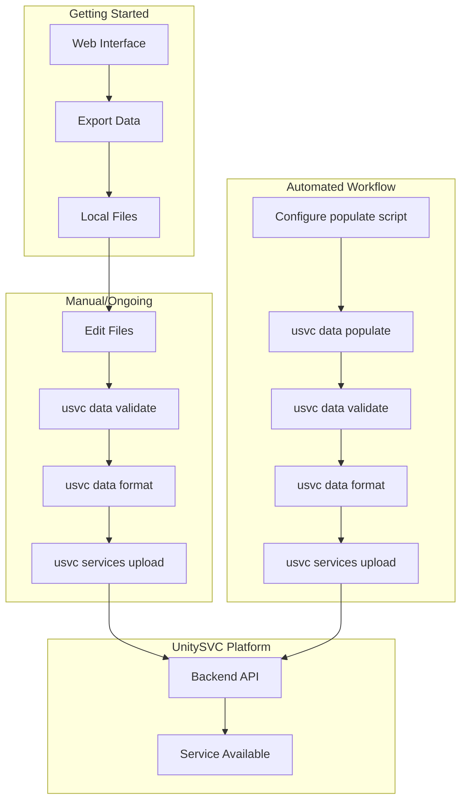
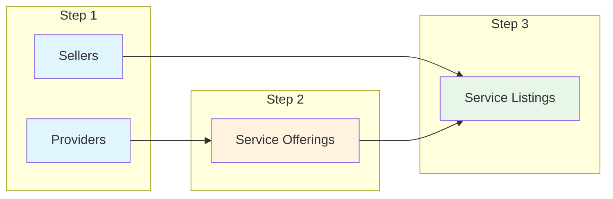

# Workflows

This guide explains the different workflows for managing service data with the UnitySVC Seller SDK.

**Note:** All examples use the shorter `usvc` command alias. You can replace `usvc` with `unitysvc_services` if preferred.

## Overview

UnitySVC provides two ways to create and manage service data:

1. **Web Interface** ([unitysvc.com](https://unitysvc.com)) - Create and edit data visually
2. **SDK** (this tool) - Manage data locally with version control and automation

The SDK supports these workflows:

1. **Web-to-SDK Workflow** - Start with web interface, export to SDK for version control
2. **Manual Workflow** - Create/edit files locally for small catalogs
3. **Automated Workflow** - Script-based generation for large or dynamic catalogs



## Web-to-SDK Workflow

**Recommended for getting started.** Use the web interface for initial setup, then transition to SDK for version control.

### Step-by-Step Process

#### 1. Create Data via Web Interface

1. Go to [unitysvc.com](https://unitysvc.com) and sign in
2. Create your Provider, Offerings, and Listings using the visual editor
3. Export your data as JSON/TOML files

#### 2. Set Up Local Directory

Place exported files in the expected structure:

```
data/
└── my-provider/
    ├── provider.json
    └── services/
        └── my-service/
            ├── offering.json
            └── listing.json
```

#### 3. Validate and Upload

```bash
usvc data validate
usvc data format
usvc services upload
```

#### 4. Ongoing Management

After initial setup, manage changes locally:

- Edit files directly
- Use `usvc data validate` to check changes
- Commit to git for version control
- Use CI/CD for automated uploads

## Manual Workflow

Best for:

- Small number of services (< 20)
- Teams comfortable editing JSON/TOML directly
- Situations where web interface isn't preferred

### Step-by-Step Process

#### 1. Create Files Manually

Create files following the [File Schemas](file-schemas.md) documentation:

```
data/
└── my-provider/
    ├── provider.json          # See provider_v1 schema
    └── services/
        └── my-service/
            ├── offering.json  # See offering_v1 schema
            └── listing.json   # See listing_v1 schema
```

#### 2. Edit Your Files

Fill in your service details:

- Provider information (name, contact, metadata)
- Service offering details (API endpoints, pricing, capabilities)
- Service listing details (user-facing info, documentation)

#### 3. Validate Data

```bash
usvc data validate
```

Fix any validation errors. Common issues:

- Directory names not matching field values
- Missing required fields
- Invalid file paths

#### 4. Format Files (Optional)

```bash
usvc data format
```

This ensures:

- JSON files have 2-space indentation
- Files end with single newline
- No trailing whitespace

#### 5. Edit Local Files as Needed

Edit JSON/TOML files directly to update service status or other fields. The file-based approach gives you full control and integrates naturally with version control.

#### 6. Upload to Platform

```bash
# Set credentials
export UNITYSVC_BASE_URL="https://api.unitysvc.com/v1"
export UNITYSVC_API_KEY="your-api-key"

# Upload all services
cd data
usvc services upload

# Or from parent directory
usvc services upload --data-path ./data
```

#### 7. Verify on Platform

```bash
# List your services
usvc services list

# Or list with custom fields for focused output
usvc services list --fields id,name,status

# Filter by status
usvc services list --status active
```

### Version Control Integration

```bash
# After creating/updating files
git add data/
git commit -m "Add new service: my-service"
git push

# Upload from CI/CD
usvc data validate
usvc services upload --data-path ./data
```

## Automated Workflow (Template-Based)

Best for providers with:

- Large service catalogs (> 20 services)
- Frequently changing services
- Dynamic pricing or availability
- Services added/deprecated automatically

### How It Works

The template-based approach separates **structure** (Jinja2 templates) from **data** (Python iterator):

```mermaid
flowchart LR
    subgraph "One-Time Setup"
        A[Create service on unitysvc.com] --> B[Export offering.json & listing.json]
        B --> C[Save as .j2 templates]
        C --> D[Replace variables with {{ placeholders }}]
    end

    subgraph "Ongoing Population"
        E[Script yields model dicts] --> F[populate_from_iterator]
        D --> F
        F --> G[services/model-name/offering.json]
        F --> H[services/model-name/listing.json]
    end
```

### Step-by-Step Process

#### 1. Create a Working Service on unitysvc.com

Start by creating a single service through the web interface:

1. Go to [unitysvc.com](https://unitysvc.com) and sign in
2. Create your Provider and one Service manually
3. Configure all fields, test that it works end-to-end
4. Export the working `offering.json` and `listing.json` files

#### 2. Convert Exported Files to Templates

Create `data/my-provider/templates/` directory and save the exported files as `.j2` templates:

```
data/my-provider/
├── provider.toml
├── templates/
│   ├── offering.json.j2    # Template for offering
│   └── listing.json.j2     # Template for listing
├── scripts/
│   └── update_services.py  # Yields model dictionaries
└── services/               # Generated output
```

#### 3. Replace Variable Parts with Template Variables

Edit the `.j2` files to replace model-specific values with Jinja2 placeholders:

**`templates/offering.json.j2`**:
```jinja2
{
  "schema": "offering_v1",
  "name": "{{ name }}",

  "display_name": "{{ display_name }}",

  "description": "{{ description | default('', true) }}",
  "service_type": "{{ service_type }}",
  "status": "{{ status | default('ready') }}",
  "currency": "USD",
  "details": {
    "model_name": "{{ model_name }}"
,
    "{{ key }}": {{ value | tojson }}

  },
  "payout_price": {
    "type": "revenue_share",
    "percentage": "100.00"
  },
  "upstream_access_interfaces": {
    "{{ provider_display_name }} API": {
      "access_method": "http",
      "api_key": "${ secrets.{{ api_key_secret }} }",
      "base_url": "{{ api_base_url }}"
    }
  }
}
```

**`templates/listing.json.j2`**:
```jinja2
{
  "schema": "listing_v1",
  "display_name": "{{ display_name | default(name) }}",
  "status": "{{ listing_status | default('ready') }}",
  "currency": "USD",

  "list_price": {
    "type": "{{ pricing.type }}"
,
    "input": "{{ pricing.input }}",
    "output": "{{ pricing.output }}"
,
    "price": "{{ pricing.price }}"

  },

  "user_access_interfaces": {
    "Provider API": {
      "access_method": "http",
      "base_url": "${GATEWAY_BASE_URL}/p/{{ gateway_path }}"
    }
  },
  "documents": {

    "Python code example": {
      "category": "code_example",
      "file_path": "../../docs/code_example_image.py.j2",
      "mime_type": "python",
      "is_public": true
    }

    "Python code example": {
      "category": "code_example",
      "file_path": "../../docs/code_example.py.j2",
      "mime_type": "python",
      "is_public": true
    }

  }
}
```

#### 4. Write Script to Yield Model Dictionaries

Create `scripts/update_services.py` that fetches from your API and yields dictionaries:

```python
#!/usr/bin/env python3
"""Generate services using templates."""

import os
from pathlib import Path
from typing import Iterator
from unitysvc_services import populate_from_iterator


def iter_models() -> Iterator[dict]:
    """Yield model dictionaries for template rendering."""
    # Fetch from your provider's API
    models = fetch_models_from_api()

    for model in models:
        # Skip models that shouldn't be published
        if not model.get("is_available"):
            continue

        yield {
            # Required - used for directory name
            "name": model["id"],

            # Offering fields
            "display_name": model.get("display_name"),
            "description": model.get("description", ""),
            "service_type": determine_service_type(model),
            "status": "ready" if model.get("active") else "draft",
            "model_name": model["full_name"],
            "details": {
                "contextLength": model.get("context_length"),
                "supportsTools": model.get("supports_tools", False),
            },

            # Listing fields
            "listing_status": "ready",
            "pricing": extract_pricing(model),

            # Provider-specific (fixed for your provider)
            "provider_display_name": "My Provider",
            "api_key_secret": "MY_PROVIDER_API_KEY",
            "api_base_url": "https://api.myprovider.com/v1",
            "gateway_path": "myprovider",
        }


def fetch_models_from_api() -> list[dict]:
    """Fetch models from provider API."""
    import requests
    api_key = os.environ["MY_PROVIDER_API_KEY"]
    response = requests.get(
        "https://api.myprovider.com/v1/models",
        headers={"Authorization": f"Bearer {api_key}"}
    )
    response.raise_for_status()
    return response.json()["models"]


def determine_service_type(model: dict) -> str:
    """Map model to service type."""
    if "embedding" in model["id"].lower():
        return "embedding"
    if "image" in model["id"].lower():
        return "image_generation"
    return "llm"


def extract_pricing(model: dict) -> dict | None:
    """Extract pricing information."""
    if "pricing" not in model:
        return None
    p = model["pricing"]
    return {
        "type": "one_million_tokens",
        "input": str(p.get("input_per_million", 0)),
        "output": str(p.get("output_per_million", 0)),
    }


if __name__ == "__main__":
    script_dir = Path(__file__).parent
    populate_from_iterator(
        iterator=iter_models(),
        templates_dir=script_dir.parent / "templates",
        output_dir=script_dir.parent / "services",
        # Optional: filter models
        filter_func=lambda m: m.get("status") == "ready",
    )
```

#### 5. Configure Provider to Run the Script

Create `data/my-provider/provider.toml`:

```toml
schema = "provider_v1"
name = "my-provider"
display_name = "My Service Provider"

[services_populator]
command = "scripts/update_services.py"
requirements = ["requests"]

[services_populator.envs]
MY_PROVIDER_API_KEY = ""  # Set via environment variable
```

#### 6. Run Populate Command

```bash
# Generate all services
usvc data populate

# Generate for specific provider only
usvc data populate --provider my-provider

# Dry run to see what would execute
usvc data populate --dry-run
```

Output shows progress:
```
[1/50] llama-3-70b
  OK: llm
[2/50] gpt-4-turbo
  OK: llm
...
Done! Total: 50, Written: 45, Skipped: 3, Filtered: 2, Errors: 0
```

#### 7. Validate, Format, and Upload

```bash
usvc data validate
usvc data format

# Review changes
git diff
git add data/
git commit -m "Update service catalog from API"

# Upload
usvc services upload
```

### Template Tips

**Conditional Fields:**
```jinja2

  "display_name": "{{ display_name }}",

```

**Iterating Over Details:**
```jinja2
"details": {

    "{{ key }}": {{ value | tojson }}{{ "," if not loop.last else "" }}

}
```

**Service Type Variations:**
```jinja2

    "file_path": "../../docs/image_example.py.j2"

    "file_path": "../../docs/chat_example.py.j2"

```

**Default Values:**
```jinja2
"status": "{{ status | default('ready') }}"
"description": "{{ description | default('', true) }}"
```

### Filtering Models

Use `filter_func` to skip models without modifying the iterator:

```python
populate_from_iterator(
    iterator=iter_models(),
    templates_dir="templates",
    output_dir="services",
    # Only include ready LLM models
    filter_func=lambda m: (
        m.get("status") == "ready" and
        m.get("service_type") == "llm"
    ),
)
```

### Automation with CI/CD

Create `.github/workflows/update-services.yml`:

```yaml
name: Update Services

on:
    schedule:
        - cron: "0 0 * * *" # Daily at midnight
    workflow_dispatch:

jobs:
    update:
        runs-on: ubuntu-latest
        steps:
            - uses: actions/checkout@v3

            - name: Set up Python
              uses: actions/setup-python@v4
              with:
                  python-version: "3.11"

            - name: Install dependencies
              run: pip install unitysvc-services requests

            - name: Generate services from templates
              env:
                  MY_PROVIDER_API_KEY: ${{ secrets.MY_PROVIDER_API_KEY }}
              run: usvc data populate

            - name: Validate
              run: usvc data validate

            - name: Format
              run: usvc data format

            - name: Commit changes
              run: |
                  git config user.name "GitHub Actions"
                  git config user.email "actions@github.com"
                  git add data/
                  git diff --staged --quiet || git commit -m "Update services from API"
                  git push

            - name: Upload to UnitySVC
              env:
                  UNITYSVC_BASE_URL: ${{ secrets.UNITYSVC_BASE_URL }}
                  UNITYSVC_API_KEY: ${{ secrets.UNITYSVC_API_KEY }}
              run: |
                  usvc services upload --data-path ./data
```

### Summary: Template-Based Workflow

| Step | Action | Output |
|------|--------|--------|
| 1 | Create working service on unitysvc.com | Verified offering.json, listing.json |
| 2 | Export and save as .j2 templates | templates/offering.json.j2, listing.json.j2 |
| 3 | Replace variables with `{{ placeholders }}` | Parameterized templates |
| 4 | Write script that yields model dicts | scripts/update_services.py |
| 5 | Call `populate_from_iterator()` | services/{name}/offering.json, listing.json |

## Hybrid Workflow

Combine web interface and automated approaches:

1. Use automated populate for most services
2. Use web interface or manual files for special/custom services
3. Edit files directly to adjust individual services

```bash
# Generate bulk of services from provider API
usvc data populate

# Create premium service via web interface and export, or create files manually
# Place in: data/my-provider/services/premium-service/

# Edit files directly to update status or other fields
# Then validate and upload
usvc data validate
usvc services upload
```

## Service Upload Lifecycle

Understanding how services are created and updated is essential for managing your catalog:

### First Upload: New Service Creation

When you upload a listing file for the **first time** (from a new repository or data directory):

1. **A new Service is always created** - even if the content is identical to an existing service
2. The Service ID is generated by the backend
3. **The SDK saves the `service_id`** to an override file (e.g., `listing.override.json`)

```bash
# First upload - creates a new service
$ usvc services upload
  + Created service: my-service (provider: my-provider)
    Service ID: 550e8400-e29b-41d4-a716-446655440000
    → Saved to listing.override.json
```

### Override File Persistence

After the first successful publish, the override file contains the stable service identity:

```json
// listing.override.json (auto-generated)
{
    "service_id": "550e8400-e29b-41d4-a716-446655440000"
}
```

**Best practices for override files:**

- **Commit to version control** - preserves service identity across team members
- **Don't manually edit** - the SDK manages this file
- **Keep per-environment** if deploying to staging/production separately

### Subsequent Uploads: Service Updates

On subsequent uploads, the SDK automatically loads the `service_id` from the override file:

```bash
# Subsequent upload - updates existing service
$ usvc services upload
  ~ Updated service: my-service (provider: my-provider)
    Service ID: 550e8400-e29b-41d4-a716-446655440000
```

The Service ID remains stable, ensuring:

- Subscriptions continue to work
- Usage history is preserved
- Customers experience no disruption

### Uploading as New Service

To create a completely new service (ignoring existing `service_id`):

```bash
# Delete the override file
rm listing.override.json

# Upload creates a new service with a new ID
usvc services upload
```

## Upload Order

**Recommended:** Use `usvc services upload` to upload all types automatically in the correct order:



1. **Sellers** - Must exist before listings
2. **Providers** - Must exist before offerings
3. **Service Offerings** - Links providers to services
4. **Service Listings** - Links sellers to offerings

The CLI handles this order automatically. Incorrect order will result in foreign key errors.

## Deleting Services

Use `usvc services delete` to remove services from the backend:

```bash
# Preview what would be deleted
usvc services delete <service-id> --dryrun

# Delete a service
usvc services delete <service-id>

# Delete multiple services
usvc services delete <service-id-1> <service-id-2>

# Force delete with active subscriptions (use with caution!)
usvc services delete <service-id> --force --yes
```

### Integration with Version Control

After deleting services, update your local repository:

```bash
# Delete local files after removing from backend
rm -rf data/my-provider/deprecated-service/

# Commit the change
git add data/
git commit -m "Remove deprecated service from catalog"
git push
```

### Best Practices for Deleting Services

**Safety:**

- **Always dryrun first** - Preview impact before deleting
- **Check subscriptions** - Avoid force-deleting services with active users
- **Use version control** - Keep deleted files in git history

**Communication:**

- **Notify users** - Warn customers before removing services
- **Deprecation period** - Use `usvc services deprecate` before deleting
- **Document reasons** - Log why services were removed

## Best Practices

### Version Control

- Commit generated files to git
- Review changes before uploading
- Use meaningful commit messages
- Tag releases

### Validation

- Always run `usvc data validate` before `usvc services upload`
- Fix all validation errors
- Use `usvc data format --check` in CI to enforce formatting

### Environment Management

- Use different API keys for dev/staging/prod
- Store secrets in environment variables, not files

### Error Handling

- Check exit codes in scripts
- Log populate script output
- Retry failed publishes with exponential backoff

### Documentation

- Document custom populate scripts
- Keep README.md updated with service catalog
- Explain any special services or pricing

## Troubleshooting

### Populate Script Fails

- Check API credentials in `services_populator.envs`
- Verify script has execute permissions
- Test script manually: `python3 populate_services.py`

### Validation Errors After Populate

- Check generated file formats
- Verify all required fields are populated
- Ensure file paths are relative

### Upload Failures

- Verify credentials are set
- Check network connectivity
- Use `usvc services upload` to handle upload order automatically
- Look for foreign key constraint errors
- Verify you're in the correct directory or using `--data-path`

## Next Steps

- [CLI Reference](cli-reference.md) - Detailed command documentation
- [Data Structure](data-structure.md) - File organization rules
- [File Schemas](file-schemas.md) - Schema specifications
